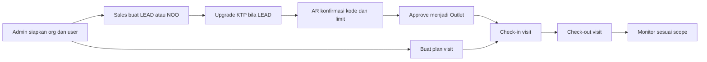
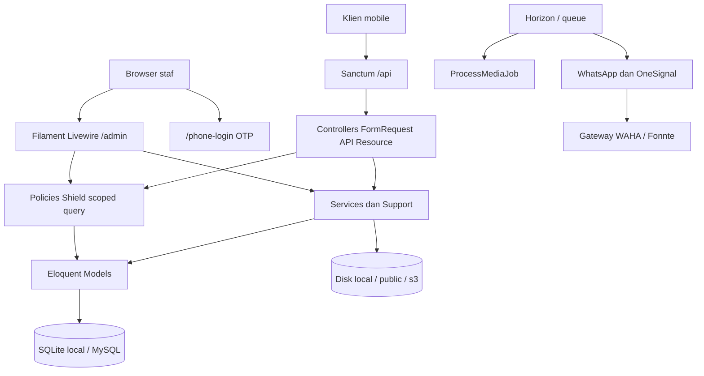

<p align="center">
  
</p>

<h1 align="center">SAM (Sales Assistant Mobile)</h1>

<p align="center">
  Backend API dan admin panel untuk tim sales lapangan: mengelola outlet,
  kunjungan, rencana visit, dan konversi LEAD/NOO menjadi outlet resmi.
</p>

SAM menyediakan dua jalur penggunaan:

- **Admin panel Filament** di `/admin` untuk operasional berbasis web.
- **REST API** di `/api` untuk klien mobile dan integrasi internal.

Bahasa utama aplikasi adalah Bahasa Indonesia (locale `id`) dan seluruh perhitungan waktu menggunakan zona waktu `Asia/Jakarta`.

> [!IMPORTANT]
> SAM adalah aplikasi internal. API memakai autentikasi Sanctum; endpoint domain utama menerapkan pemeriksaan role, policy, dan scope organisasi (badan usaha → divisi → region → cluster). Resource Filament memakai policy dan scoped query. Jangan membuka aplikasi ke klien yang tidak tepercaya.

## Daftar isi

- [Tujuan dan scope](#tujuan-dan-scope)
- [Fitur utama](#fitur-utama)
- [Role, hierarchy, dan hak akses](#role-hierarchy-dan-hak-akses)
- [Cara kerja aplikasi](#cara-kerja-aplikasi)
- [Arsitektur](#arsitektur)
- [Tech stack](#tech-stack)
- [Persiapan development](#persiapan-development)
- [Konfigurasi environment](#konfigurasi-environment)
- [Menjalankan aplikasi](#menjalankan-aplikasi)
- [API dan dokumentasi](#api-dan-dokumentasi)
- [Workflow development](#workflow-development)
- [Testing dan quality check](#testing-dan-quality-check)
- [Batasan dan technical debt](#batasan-dan-technical-debt)
- [Troubleshooting](#troubleshooting)

## Tujuan dan scope

SAM menyatukan operasional sales lapangan dengan administrasi HO. Alur utamanya dimulai dari master organisasi dan akun, dilanjutkan pengajuan LEAD/NOO, approval menjadi outlet, perencanaan kunjungan, lalu check-in/out visit yang dipantau sesuai scope.

### Termasuk dalam scope

- Panel Filament di `/admin`: dashboard, user, role, badan usaha, divisi, region, cluster, register, outlet, visit, plan visit, system setting, audit, dan diagram jabatan.
- REST API di `/api` untuk auth, profil, user, outlet, register (LEAD/NOO), visit, plan visit, master organisasi, dan CRUD management organisasi.
- Hierarki organisasi badan usaha → divisi → region → cluster, plus scope role (`all` / `badanusaha` / `divisi` / `region` / `cluster`).
- Role seed `SUPER ADMIN`, `ADMIN`, `AR`, `ASM`, dan `SALES`.
- Login panel username/kata sandi di `/admin/login` dan OTP WhatsApp di `/phone-login`.
- Login API username/kata sandi (`POST /api/login`) dan OTP WhatsApp (`/api/login/whatsapp/*`).
- Import/export Excel (outlet, user, plan visit, visit, register) di panel.
- Pemrosesan media ke disk Laravel (`local` / `public` / `s3`), antrean Horizon, notifikasi WhatsApp, dan push OneSignal.
- Dokumentasi OpenAPI Scramble di `/docs/api` (gate `SUPER ADMIN`).

### Di luar scope implementasi saat ini

- Source aplikasi mobile; repositori ini adalah backend Laravel + panel Filament. Klien mobile memanggil `/api`.
- SSO, registrasi publik, dan reset password mandiri. Reset password panel sengaja dimatikan; akun dibuat administrator.
- Payroll, reimbursement, cuti, atau HRIS penuh.
- Pipeline CI/CD, image container, atau orkestrasi Docker Compose di repositori ini.

## Fitur utama

Ketersediaan modul pada setiap surface saat ini:

| Modul | Panel `/admin` | API `/api` | Keterangan |
|---|:---:|:---:|---|
| Auth username/password | Ya (`/admin/login`) | Ya (`POST /api/login`) | Panel memakai username, bukan email |
| Login OTP WhatsApp | Ya (`/phone-login`) | Ya (`/api/login/whatsapp/*`) | Membutuhkan gateway WhatsApp |
| Dashboard operasional | Ya | Tidak | Widget `DataOverview` |
| User, role, impersonate | Ya | Ya (CRUD user) | Shield + policy; SALES tidak masuk panel |
| Master organisasi | Ya | Ya (baca + `/api/management/*`) | Badan usaha, divisi, region, cluster |
| Register LEAD/NOO | Ya | Ya | Submit, upgrade, confirm, approve, reject |
| Outlet | Ya | Ya | Update, reset, arsip perubahan, restore |
| Visit check-in/out | Ya | Ya | Target outlet atau register |
| Plan visit | Ya | Ya | Cutoff unggah mingguan (default Rabu 17:00) |
| Import/export Excel | Ya | Tidak | Maatwebsite Excel |
| System setting | Ya | Tidak | Resolver pengaturan runtime |
| Audit / activity log | Ya | Tidak | Spatie Activitylog |
| Dokumentasi API | Tautan SUPER ADMIN | `/docs/api` | Gate `viewApiDocs` |
| Health check | `/up` | `/up` | Route health Laravel |

> [!NOTE]
> Role `SALES` di-seed dengan `can_access_web=false` dan `can_access_mobile=true`. Akun seed `sales` memakai API/mobile, bukan panel `/admin`.

## Role, hierarchy, dan hak akses

Role awal dari seeder adalah `SUPER ADMIN`, `ADMIN`, `AR`, `ASM`, dan `SALES`.

Hak akses ditentukan permission Filament Shield pada masing-masing role, lalu dipersempit oleh policy dan scope organisasi. Nama role saja tidak cukup; periksa [`app/Policies`](app/Policies), [`app/Support/OrganizationalScope.php`](app/Support/OrganizationalScope.php), dan [`app/Models/User.php`](app/Models/User.php).

### Model hierarchy

- Master organisasi: **badan usaha → divisi → region → cluster**.
- User diikat ke unit lewat pivot `user_badan_usaha`, `user_divisi`, `user_regions`, `user_clusters`.
- `roles.organizational_scope_level` membatasi data yang terlihat: `all`, `badanusaha`, `divisi`, `region`, atau `cluster`.
- Pohon role seed: `SALES` induknya `ASM`, `ASM` induknya `ADMIN`.
- `users.tm_id` menunjuk atasan/tim; dipakai notifikasi dan relasi register, bukan pengganti policy.

### Akses efektif

| Aktor | Scope seed | Panel `/admin` | Akses utama |
|---|---|---|---|
| `SUPER ADMIN` | `all` | Ya | Seluruh permission, termasuk tautan API Docs |
| `ADMIN` | `all` | Ya | Master data, user, laporan, operasional penuh (permission seed = semua) |
| `AR` | `all` | Ya | Validasi register: lihat/ubah, confirm, approve, reject, export; lihat outlet/visit |
| `ASM` | `region` | Ya | User tim, outlet (reset/lokasi), monitor visit/plan visit, export |
| `SALES` | `cluster` | Tidak | Outlet, buat register, visit, plan visit lewat API/mobile |

`User::canAccessPanel()` hanya mengizinkan role dengan `can_access_web`. Query list memakai `visibleTo` / `OrganizationalScope`; jangan menganggap opsi yang tampil di UI sebagai boundary authorization.

### Akun uji development

Kredensial berikut hanya dibuat oleh `php artisan db:seed` / `migrate --seed`. Jangan membuat atau mempertahankan kata sandi tetap ini pada lingkungan production.

| Nama seed | Username | Role | Kata sandi | Masuk `/admin` |
|---|---|---|---|---|
| SUPER ADMINISTRATOR | `superadmin` | `SUPER ADMIN` | `superadmin123` | Ya |
| ADMINISTRATOR | `admin` | `ADMIN` | `admin123` | Ya |
| AR VALIDATOR | `ar` | `AR` | `ar123` | Ya |
| ASM SUPERVISOR | `asm` | `ASM` | `asm123` | Ya |
| SALES REPRESENTATIVE | `sales` | `SALES` | `sales123` | Tidak (`can_access_web=false`) |

Seeder organisasi contoh: badan usaha `PT.MSI` dan `CV.TOP`, plus divisi/region/cluster terkait. Outlet, plan visit, dan visit **tidak** di-seed pada `DatabaseSeeder` default.

## Cara kerja aplikasi



### 1. Bootstrap organisasi dan user

1. Administrator menyiapkan badan usaha, divisi, region, cluster, dan role melalui resource master atau seeder.
2. Setiap user mendapat satu `role_id` plus pivot organisasi sesuai level scopenya.
3. Policy dan `OrganizationalScope` memakai grants efektif user untuk membatasi list/detail di panel dan API.
4. User dapat dibuat di panel, di-import Excel, atau lewat `POST /api/users` (permission `can_manage_user` / create).

### 2. LEAD/NOO menjadi outlet

1. Sales mengirim `POST /api/registers/leads` (`type=LEAD`, tanpa KTP) **atau** `POST /api/registers/noos` (`type=NOO`, dengan KTP). Hierarki organisasi wajib lengkap.
2. LEAD di-upgrade ke NOO lewat `PATCH /api/registers/{id}/upgrade` (unggah foto KTP dan nomor KTP). Status NOO baru adalah `PENDING`.
3. Validator (`AR` atau role berpermission confirm) mengirim `PATCH /api/registers/{id}/confirm` dengan `kode_outlet`, `limit`, dan `status=CONFIRMED`.
4. Approval `PATCH /api/registers/{id}/approve` memanggil `RegisterApprovalService`: register `CONFIRMED` menjadi `APPROVED` dan outlet dibuat atau disegarkan. Duplikat kode di divisi yang sama dapat di-branch, di-override, atau ditolak.
5. Penolakan memakai `PATCH /api/registers/{id}/reject`.
6. Panel Register menampilkan alur yang sama dengan action Filament.

### 3. Visit check-in/out

1. Satu user hanya boleh punya satu visit aktif (belum check-out) pada hari berjalan.
2. `POST /api/visit/checkin` menerima `outlet_id` **atau** `register_id` yang terlihat oleh user, plus foto check-in dan `latlong_in`.
3. `POST /api/visit/{id}/checkout` menyimpan foto check-out, `latlong_out`, laporan, dan durasi (menit).
4. `GET /api/visit/monitor` dan resource Visit di panel dipakai ASM/admin untuk memantau sesuai scope.
5. Foto diproses lewat `FileUploadService` / `ProcessMediaJob` (antrean).

### 4. Plan visit

- `GET/POST/DELETE /api/planvisit` dan resource Plan Visit di panel.
- Import plan visit di panel menghormati cutoff `PLAN_VISIT_UPLOAD_CUTOFF_DAY` / `PLAN_VISIT_UPLOAD_CUTOFF_TIME` (default Rabu 17:00).
- Realisasi plan dihubungkan ke visit; command `visits:clean-orphan-planned` dan `visits:fix-mislinked-plans` memperbaiki data yang tidak konsisten.

### 5. Login

- Panel: username + kata sandi di `/admin/login`, atau OTP WhatsApp di `/phone-login`.
- API: `POST /api/login` (username, password, `version` ≥ `2.1.0`, `notif_id`) mengembalikan token Sanctum; OTP di `POST /api/login/whatsapp/request-otp` dan `verify-otp`.
- Reset password panel dimatikan (`passwordReset(null)`). Profil diubah lewat halaman profil Filament.

## Arsitektur



### Peta source code

| Lokasi | Tanggung jawab |
|---|---|
| `app/Filament/Resources` | CRUD panel: user, role, org, register, outlet, visit, plan visit, setting, audit |
| `app/Filament/Pages` | Dashboard, diagram jabatan, login/profil |
| `app/Filament/Auth` | Halaman OTP WhatsApp panel |
| `app/Filament/Widgets` | Ringkasan operasional |
| `app/Http/Controllers/API` | Endpoint REST `/api` |
| `app/Http/Requests/API` | Validasi input API |
| `app/Http/Resources` | Bentuk JSON API |
| `app/Models` | Model dan relasi Eloquent |
| `app/Policies` | Authorization panel dan API |
| `app/Services` | Approval register, upload, WhatsApp, OTP, cache organisasi |
| `app/Support` | Scope organisasi, storage disk, import, dashboard |
| `app/Jobs` | Media, notifikasi, import, hapus file |
| `app/Console/Commands` | Perbaikan plan visit, cek koneksi disk |
| `app/Exports` / `app/Imports` | Excel |
| `database/migrations` | Evolusi schema |
| `database/seeders` | Data awal development |
| `routes/api.php` | Route REST |
| `routes/web.php` | Redirect `/` → `/admin`, phone-login |
| `routes/console.php` | Jadwal Artisan (opsional) |
| `docs/API.md` | Kontrak field API (pointer) |
| `tests` | Pest Feature/Unit |

Folder Repository belum ada; sebagian controller API masih gemuk dan berbicara langsung ke model. Itu technical debt, bukan pola yang sudah selesai.

## Tech stack

| Komponen | Teknologi |
|---|---|
| Backend | PHP `^8.3`, Laravel 12 |
| Admin UI | Filament 4, Livewire, Mekaya Theme |
| Frontend build | Vite 6, Tailwind CSS 4 |
| Database | SQLite default `.env.example`; MySQL/MariaDB untuk deployment utama; SQLite in-memory untuk test |
| Filesystem | Disk Laravel `local` / `public` / `s3` (`FILESYSTEM_DISK`; S3 memakai `league/flysystem-aws-s3-v3`) |
| API auth | Laravel Sanctum 4 |
| API docs | Dedoc Scramble / OpenAPI |
| Authorization | Filament Shield / Spatie Permission |
| Queue | Laravel Horizon 5; default `.env.example` `QUEUE_CONNECTION=redis` |
| Runtime opsional | Laravel Octane 2, FrankenPHP (`OCTANE_SERVER=frankenphp`) |
| Import/export | Maatwebsite Excel `^3.1` |
| Observability | Spatie Activitylog, Debugbar (dev) |
| Notifikasi | WhatsApp (WAHA + cadangan Fonnte), OneSignal |
| Test | Pest 4 / `php artisan test` |
| Formatter | Laravel Pint |

Repositori ini **tidak** mengirim Docker Compose, workflow CI, PHPStan, atau Rector.

## Persiapan development

### Prasyarat

- Git.
- PHP 8.3 atau lebih baru.
- Composer 2.
- Node.js 20+ (Vite 6).
- SQLite untuk setup local default; MySQL 8+ atau MariaDB yang kompatibel untuk deployment utama.
- Redis jika memakai default `QUEUE_CONNECTION=redis` dan Horizon.
- Extension PHP yang biasa dipakai Laravel/Filament, termasuk `curl`, `fileinfo`, `gd`, `intl`, `mbstring`, `openssl`, `pdo_sqlite` atau `pdo_mysql`, `xml`, dan `zip`.

Gateway WhatsApp, S3, OneSignal, dan Octane bersifat opsional untuk menjalankan panel dasar. OTP dan notifikasi WhatsApp membutuhkan konfigurasi `WHATSAPP_GATEWAY_*`.

### Clone dan dependency

```bash
git clone https://github.com/oceanspacedev/sam-web.git
cd sam-web

composer install
cp .env.example .env
php artisan key:generate
npm ci
```

Jangan menjalankan `composer update` hanya untuk setup; gunakan versi dependency yang dikunci oleh `composer.lock`.

### Konfigurasi database

Seperti skeleton Laravel 12, `.env.example` memakai SQLite. Buat file database bila menjalankan langkah setup secara manual:

```bash
php -r "file_exists('database/database.sqlite') || touch('database/database.sqlite');"
```

Untuk memakai MySQL/MariaDB, ganti koneksi di `.env` dan buat database kosong:

```dotenv
APP_NAME=SAM
APP_ENV=local
APP_DEBUG=true
APP_URL=http://127.0.0.1:8000

DB_CONNECTION=mysql
DB_HOST=127.0.0.1
DB_PORT=3306
DB_DATABASE=sam
DB_USERNAME=root
DB_PASSWORD=
```

Nilai `APP_NAME` di `.env.example` masih `Laravel`; set ke `SAM` pada development.

Untuk local tanpa Redis, antrean bisa disinkronkan:

```dotenv
QUEUE_CONNECTION=sync
```

#### Fresh onboarding

Pastikan `.env` menunjuk ke database development yang kosong, lalu jalankan:

```bash
php artisan migrate --seed
php artisan storage:link
```

Perintah di atas setara dengan migrasi lalu seeder terpisah:

```bash
php artisan migrate
php artisan db:seed
php artisan storage:link
```

> [!WARNING]
> Jangan menjalankan `php artisan migrate:fresh`, `migrate:refresh`, atau `db:wipe` pada database yang berisi data. Perintah tersebut menghapus tabel/data. Jangan menjalankan seeder development di production.

Seeder membuat role, permission Shield, hierarki organisasi contoh, dan akun di tabel di atas. Outlet/visit tidak ikut di-seed. Ganti password seed segera.

## Konfigurasi environment

Jangan commit `.env` atau credential apa pun ke Git. Daftar berikut mengikuti [`.env.example`](.env.example).

| Variabel | Wajib | Fungsi |
|---|:---:|---|
| `APP_KEY` | Ya | Kunci enkripsi Laravel; dibuat dengan `php artisan key:generate` |
| `APP_URL` | Ya | Base URL aplikasi, asset, dan tautan |
| `APP_NAME` | Tidak | Nama tampilan; `.env.example` `Laravel` |
| `APP_ENV` / `APP_DEBUG` | Ya | Environment dan debug |
| `DB_CONNECTION` / `DB_*` | Ya | Driver dan koneksi; default contoh `sqlite` |
| `CACHE_STORE` | Ya | Cache default Laravel; `.env.example` `database` |
| `FILESYSTEM_DISK` | Ya | Disk default; `local`, `public`, atau `s3` |
| `SESSION_DRIVER` | Ya | Penyimpanan session; default contoh `database` |
| `QUEUE_CONNECTION` | Ya | Backend queue; default contoh `redis` |
| `QUEUE_RETRY_AFTER` | Tidak | Timeout retry job Redis; default `900` |
| `REDIS_CLIENT` / `REDIS_HOST` / `REDIS_PASSWORD` / `REDIS_PORT` | Jika Redis dipakai | Koneksi Redis untuk queue/Horizon |
| `MAIL_*` | Untuk email | SMTP; `.env.example` memakai `MAIL_MAILER=log` |
| `AWS_ACCESS_KEY_ID` / `AWS_SECRET_ACCESS_KEY` / `AWS_DEFAULT_REGION` / `AWS_BUCKET` | Untuk S3 | Disk `s3` |
| `AWS_ENDPOINT` / `AWS_URL` / `AWS_USE_PATH_STYLE_ENDPOINT` | Untuk S3-compatible | Endpoint path-style / MinIO / SeaweedFS |
| `ONESIGNAL_APP_ID` | Untuk push | Helper `SendNotif` / `SendNotificationJob` |
| `WHATSAPP_GATEWAY_PROVIDER` / `WHATSAPP_GATEWAY_FALLBACK_PROVIDER` | Untuk WhatsApp | Default `waha` dengan cadangan `fonnte` |
| `WHATSAPP_GATEWAY_WAHA_BASE_URL` / `WHATSAPP_GATEWAY_WAHA_API_KEY` / `WHATSAPP_GATEWAY_WAHA_SESSION` | Untuk WAHA | Gateway utama |
| `WHATSAPP_GATEWAY_FONNTE_ENDPOINT` / `WHATSAPP_GATEWAY_FONNTE_TOKEN` | Untuk Fonnte | Cadangan |
| `WHATSAPP_OTP_EXPIRES_IN` | Tidak | Umur OTP detik; default `60` |
| `WHATSAPP_QUEUE_DELAY_SECONDS` | Tidak | Jeda antrean kirim; default `10` |
| `SAM_ANDROID_DOWNLOAD_URL` / `SAM_IOS_TESTFLIGHT_URL` | Tidak | Tautan di pesan WhatsApp akun terdaftar |
| `PLAN_VISIT_UPLOAD_CUTOFF_DAY` / `PLAN_VISIT_UPLOAD_CUTOFF_TIME` | Tidak | Default `wednesday` / `17:00` |
| `IMPORT_SYNC_FALLBACK` / `IMPORT_FORCE_SYNC` / `IMPORT_SUMMARY_TTL_MINUTES` | Tidak | Perilaku import Excel |
| `OCTANE_SERVER` / `OCTANE_HTTPS` | Tidak | Default contoh `frankenphp` / `true`; tidak wajib untuk `artisan serve` |

Jangan memasukkan secret ke Git. Untuk local tanpa SMTP, biarkan `MAIL_MAILER=log`.

Panel dan API dasar tetap berjalan tanpa WhatsApp. Tanpa `WHATSAPP_GATEWAY_WAHA_API_KEY` (atau token Fonnte jika cadangan dipakai), OTP login dan notifikasi WhatsApp tidak selesai.

## Menjalankan aplikasi

Jalankan backend dan Vite pada terminal terpisah:

```bash
php artisan serve
```

```bash
npm run dev
```

Buka:

- Panel: `http://127.0.0.1:8000/admin` (`/` mengarah ke sini)
- Login OTP: `http://127.0.0.1:8000/phone-login`
- Health check: `http://127.0.0.1:8000/up`
- Dokumentasi API: `http://127.0.0.1:8000/docs/api` (gate `SUPER ADMIN`; Scramble juga longgar di `local`)

Queue default contoh adalah `redis`. Jalankan worker atau Horizon saat fitur yang mengantrekan job dipakai (media, notifikasi, import):

```bash
php artisan queue:work
```

```bash
php artisan horizon
```

Scheduler tidak wajib untuk UI.

Untuk frontend production-like:

```bash
npm run build
```

Octane/FrankenPHP opsional dan tidak menggantikan `php artisan serve` untuk onboarding local.

### Storage file

Disk mengikuti standar Laravel. `FILESYSTEM_DISK` memilih `local`, `public`, atau `s3`. Upload media (`FileUploadService`, Filament `FileUpload`) dan URL (`StorageDisk::url()`) memakai disk default itu.

- `public`: file di `storage/app/public`, URL `/storage/...` setelah `php artisan storage:link`
- `s3`: objek di bucket `AWS_BUCKET`; URL dari `Storage::url()` / `AWS_URL`
- `local`: file privat di `storage/app/private`

Cek koneksi disk (berguna untuk S3):

```bash
php artisan storage:check-disk
php artisan storage:check-disk s3 --write
```

## API dan dokumentasi

Base URL API:

```text
http://127.0.0.1:8000/api
```

Endpoint publik saat ini:

| Method | Path |
|---|---|
| POST | `/api/login` |
| POST | `/api/login/whatsapp/request-otp` |
| POST | `/api/login/whatsapp/verify-otp` |
| POST | `/api/notif` |

`POST /api/test-upload` hanya ada di environment `local` / `testing`. Endpoint domain lain berada di balik middleware `auth:sanctum` (dan `logku`).

Login password:

```bash
curl --request POST http://127.0.0.1:8000/api/login \
  --header 'Accept: application/json' \
  --header 'Content-Type: application/json' \
  --data '{
    "username": "superadmin",
    "password": "superadmin123",
    "version": "2.1.0",
    "notif_id": "local-dev"
  }'
```

Gunakan token dari `data.access_token` sebagai bearer:

```bash
curl http://127.0.0.1:8000/api/user \
  --header 'Accept: application/json' \
  --header 'Authorization: Bearer <token>'
```

`version` pada login wajib ≥ `2.1.0`. Kredensial di contoh hanya untuk database yang baru di-seed.

Referensi API:

- UI OpenAPI: `/docs/api` (permission gate `viewApiDocs` = role `SUPER ADMIN`)
- Spesifikasi JSON: `/docs/api.json`
- Route source: [`routes/api.php`](routes/api.php)
- Kontrak field: [`docs/API.md`](docs/API.md)

Untuk melihat daftar endpoint aktual:

```bash
php artisan route:list --path=api
```

Mayoritas response memakai envelope:

```json
{
  "meta": {
    "code": 200,
    "status": "success",
    "message": "human readable message"
  },
  "data": {},
  "errors": null
}
```

Sukses domain umumnya `200`. Auth gagal `401`, terlarang `403`, hilang `404`, validasi `422`, throttle `429`, gagal kirim OTP WhatsApp `502`. List yang memakai `JsonResource::collection` pada paginator Laravel dapat menambah `links` dan field pagination di `meta`.

## Workflow development

Branch default repositori adalah `main`. Buat cabang pekerjaan dari `main` dengan pola `feat/<scope>`, `fix/<scope>`, atau `docs/<scope>`.

### Memulai pekerjaan

```bash
git switch main
git pull --ff-only origin main
git switch -c feat/<nama-fitur>
```

Gunakan scope kecil dan satu tujuan per branch.

### Lokasi perubahan berdasarkan jenis fitur

| Kebutuhan | Lokasi umum |
|---|---|
| Tambah/ubah tabel | `database/migrations` dan `app/Models` |
| Logika bisnis reusable | `app/Services`, `app/Support` |
| Hak akses panel/API | `app/Policies`, seeder permission/role, `OrganizationalScope` |
| Fitur panel web | `app/Filament/Resources`, `Pages`, atau `Widgets` |
| Endpoint API | Controller + FormRequest + API Resource + `routes/api.php` |
| Background operation | `app/Jobs`, `app/Console/Commands`, `routes/console.php` |
| Import/export | `app/Imports`, `app/Exports`, `app/Filament/Exports` |
| Verifikasi | `tests/Unit` atau `tests/Feature` |

### Aturan implementasi

- Jangan mengubah schema melalui migration yang sudah pernah berjalan di shared environment; tambahkan migration baru.
- Scope organisasi lewat `OrganizationalScope` / `visibleTo`; jangan menyalin filter pivot di banyak tempat.
- Endpoint API baru wajib FormRequest + policy/Gate atau ownership check yang setara.
- Perubahan konfigurasi wajib diikuti update `.env.example` dan README tanpa memasukkan secret.
- Tambahkan test regresi untuk setiap perbaikan bug pada register, visit, policy, atau storage.

### Definition of Done

Sebelum membuka PR, pastikan:

- Scope bisnis dan aktor yang boleh mengakses sudah jelas.
- Test terkait ditambahkan dan `php artisan test` berhasil pada area yang diubah.
- `npm run build` berhasil bila ada perubahan frontend/Filament asset.
- Tidak ada `.env`, token, dump database, data pribadi, atau credential di commit.

## Testing dan quality check

`phpunit.xml` mengunci test ke SQLite in-memory (`DB_CONNECTION=sqlite`, `DB_DATABASE=:memory:`), `CACHE_DRIVER=array`, session array, queue sync, dan mail array. Full test suite tidak menggunakan database development dari `.env`.

```bash
php artisan test
php artisan test --filter=NamaTest
```

Quality check yang didukung repositori:

```bash
vendor/bin/pint --test
composer validate --strict
npm run build
```

Tidak ada PHPStan/Rector di repositori ini.

## Batasan dan technical debt

Daftar ini adalah batas perilaku aktual, bukan fitur yang dijanjikan:

1. **Controller API masih gemuk.** `RegisterController`, `VisitController`, dan `PlanVisitController` masih banyak berbicara ke model/queue. Folder Repository belum ada; PHPDoc service/controller belum seragam.
2. **`POST /api/notif` publik.** Helper OneSignal tidak berada di belakang Sanctum; batasi pemakaiannya dan jangan anggap sebagai kontrak klien.
3. **Gate Horizon longgar/tidak selaras.** `viewHorizon` memeriksa `hasRole('admin')` (huruf kecil) dan daftar email hardcoded; role seed adalah `ADMIN`. Jangan mengandalkan `/horizon` sebagai boundary yang sudah diaudit.
4. **Role `SALES` tidak masuk panel.** `can_access_web=false`; akun seed `sales` ditolak `canAccessPanel()`.
5. **Seeder development bukan data produksi.** Password tetap, tanpa outlet/visit, dan tidak untuk dijalankan berulang di environment berisi data.
6. **Queue default `redis`.** Tanpa Redis, job media/notifikasi/Horizon gagal sampai `QUEUE_CONNECTION` diubah (misalnya `sync` local).
7. **Tidak ada Docker Compose atau CI di repo.** Deployment, image, dan quality gate otomatis dikelola di luar repositori ini.
8. **Reset password dan registrasi publik dimatikan.** Onboarding user tetap manual / seeder / import.
9. **Login API menolak klien dengan `version` di bawah `2.1.0`.**

## Troubleshooting

### Composer menolak versi PHP

Pastikan CLI memakai PHP 8.3 atau lebih baru:

```bash
php -v
composer check-platform-reqs
```

### Vite manifest not found

```bash
npm ci
npm run build
php artisan optimize:clear
```

### Perubahan config atau route tidak terbaca

```bash
php artisan optimize:clear
```

### Lampiran atau asset `/storage` 404

Untuk `FILESYSTEM_DISK=public`:

```bash
php artisan storage:link
```

Untuk `FILESYSTEM_DISK=s3`, URL file datang dari disk `s3` (`AWS_URL` / `Storage::url()`), bukan symlink `public/storage`. Cek kredensial dengan `php artisan storage:check-disk s3`.

### OTP WhatsApp atau notifikasi tidak terkirim

1. Isi `WHATSAPP_GATEWAY_PROVIDER` (`waha` atau `fonnte`) plus kredensial terkait (`WHATSAPP_GATEWAY_WAHA_*` atau `WHATSAPP_GATEWAY_FONNTE_TOKEN`).
2. Pastikan nomor valid (format `08…` atau `62…`).
3. Periksa `storage/logs/laravel.log`.
4. Jika `QUEUE_CONNECTION=redis`, pastikan Redis dan worker/Horizon berjalan.

### Queue / Horizon tidak memproses job

Pastikan Redis hidup, `QUEUE_CONNECTION=redis`, lalu `php artisan horizon` atau `php artisan queue:work`. Untuk development tanpa Redis, set `QUEUE_CONNECTION=sync`.

### Login panel ditolak

Pastikan role user punya `can_access_web=true`. Akun seed `sales` memang tidak boleh masuk `/admin`. Panel login memakai **username**, bukan email.

### `/docs/api` 403

Masuk sebagai `SUPER ADMIN` (gate `viewApiDocs`). Di `APP_ENV=local` Scramble biasanya tetap dapat dibuka untuk development.
