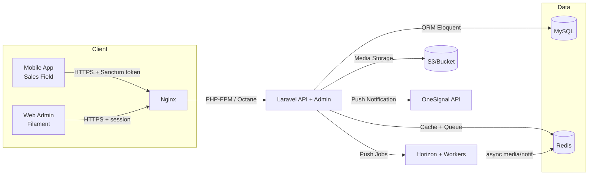
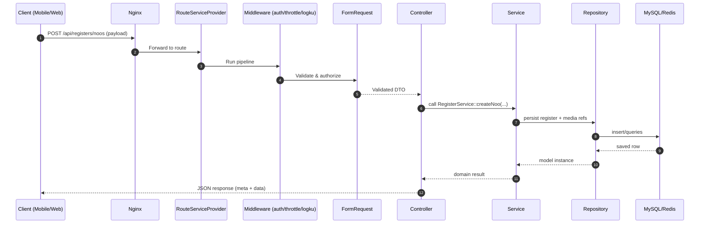
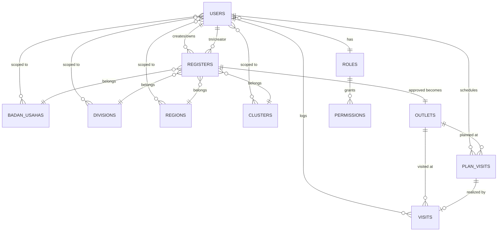

# SAM (Sales Assistant Mobile)

 SAM adalah backend API + admin panel untuk tim sales lapangan dalam mengelola outlet, kunjungan, dan proses konversi LEAD/NOO menjadi outlet resmi. Pengguna utama: sales lapangan (mobile), team leader/area manager (monitoring), dan admin HO (Filament admin). Teknologi utama: Laravel 12 (PHP 8.2), Sanctum untuk auth token, MySQL sebagai database utama, Redis untuk antrean & rate-limit (cache opsional – default driver saat ini `file`), Octane untuk runtime server, Filament 4 untuk admin panel, media storage via Filesystem (S3 siap pakai), Excel export, dan push notification eksternal via OneSignal (HTTP API).

## Arsitektur high-level



- **Client**: Mobile app memanggil `/api` (token Sanctum) dan admin web memakai Filament.
- **Nginx**: Terminate TLS, routing ke PHP-FPM/Octane.
- **Laravel**: Menyediakan API publik (auth, register outlet, visit) dan admin panel. Menangani validasi, bisnis logic, dan akses data.
- **MySQL**: Sumber data utama untuk user, register/NOO, outlet, plan/visit, RBAC.
- **Redis + Horizon**: Rate-limit dan antrean (media processing, push notif OneSignal); cache hanya jika `CACHE_DRIVER=redis`.
- **S3/Bucket**: Penyimpanan file foto/video register/visit (driver sudah tersedia).
- **OneSignal**: Pengiriman push notification eksternal melalui helper `SendNotif`/`SendNotificationJob`.

## Request lifecycle (HTTP)

1. **Route** menangkap path (contoh `POST /api/registers/noos`).
2. **Middleware** berjalan berurutan (throttle, `auth:sanctum`, `logku`, dsb.).
3. **Form Request** melakukan validasi & otorisasi input.
4. **Controller** tipis: mapping input → service, pilih response.
5. **Service layer**: mengeksekusi bisnis logic (perhitungan, workflow status, enqueue job).
6. **Repository**: (target) mengelola query kompleks ke Model/Eloquent.
7. **Model/Eloquent** berbicara ke MySQL/Redis.
8. **Response** dikembalikan ke client dengan kontrak JSON baku.



**Aturan bersama**:
- Validasi mayoritas via **Form Request** untuk endpoint inti; pengecualian: `SettingController` (GET master data) dan helper `/api/notif` + `/api/test-upload` memakai `Illuminate\Http\Request`.
- Controller hanya untuk HTTP concerns; bisnis logic pindah ke **Service**.
- Query kompleks & agregasi ditempatkan di **Repository** (hindari query mentah di controller).
- Media/pekerjaan berat dikirim ke **queue**; hindari blocking request.

## Modul & use case utama

| Modul | Fungsi utama | Endpoint kunci (API) | Controller/Komponen |
| --- | --- | --- | --- |
| Auth & User | Login, logout, session user saat ini, CRUD user | `POST /api/login`, `POST /api/logout`, `GET /api/user`, `GET/POST/PUT/DELETE /api/users` | `UserController`, `LoginRequest`, Sanctum (Form Request) |
| RBAC & Master Data | Scope organisasi (badan usaha/divisi/region/cluster), role & permission | `GET /api/badanusaha`, `/divisi`, `/region`, `/cluster`, `/roles`, `/form-options` | `SettingController`, Spatie Roles/Permissions, Filament Shield |
| Register (LEAD/NOO) & Outlet | Input prospek, upgrade ke NOO, konfirmasi & approval jadi outlet | `POST /api/registers/leads`, `POST /api/registers/noos`, `PATCH /api/registers/{id}/upgrade`, `PATCH /confirm`, `PATCH /approve`, `PATCH /reject`, `GET /api/registers`/`/all`/`/pending` | `RegisterController`, `SubmitLeadRequest`, `SubmitNooRequest`, `UpgradeLeadRequest`, `ConfirmNooRequest`, `ApproveNooRequest`, `RejectNooRequest`, `RegisterResource` |
| Outlet Management | Detail outlet + update info | `GET /api/outlet`, `GET /api/outlet/{id}`, `POST /api/outlet/{id}` | `OutletController`, `UpdateOutletRequest` |
| Visit & Monitoring | Check-in/out kunjungan, dashboard monitoring | `GET /api/visit`, `POST /api/visit/checkin`, `POST /api/visit/{id}/checkout`, `GET /api/visit/monitor` | `VisitController`, `CheckinVisitRequest`, `CheckoutVisitRequest`, `VisitResource` |
| Plan Visit | Penjadwalan kunjungan (harian/mingguan) | `GET /api/planvisit`, `POST /api/planvisit`, `DELETE /api/planvisit` | `PlanVisitController`, `StorePlanVisitRequest`, `DeletePlanVisitRequest` |
| Notifikasi | Kirim push OneSignal | `POST /api/notif` (helper sinkron), queue `notifications` via alur bisnis (job) | `SendNotif`, `SendNotificationJob`, Redis/Horizon |
| Admin Panel | CRUD via Filament (role, user, outlet, register, master data) | Web `/admin` | Filament 4, Filament Shield, Impersonate |

### Alur kritikal (contoh)
- **Pengajuan NOO/Lead → Outlet**  
  1) `POST /api/registers/leads` (`RegisterController@submitLead`) menyimpan LEAD dengan media temp.  
  2) `PATCH /api/registers/{id}/upgrade` (`upgradeLead`) mengunggah KTP → status NOO.  
  3) `PATCH /api/registers/{id}/confirm` (`confirmNoo`) menetapkan `kode_outlet` & limit; `SendNotificationJob` dijalankan.  
  4) `PATCH /api/registers/{id}/approve` (`approveNoo`) membuat/menyegarkan `Outlet` dari `Register`; response saat ini mengembalikan data `Register`.  
  Target refactor: ekstrak ke `RegisterService` + `RegisterRepository`, pemrosesan media ke job terpisah.

- **Visit check-in/out**  
  1) `POST /api/visit/checkin` (`VisitController@checkin`) validasi outlet & foto check-in; simpan koordinat/waktu.  
  2) `POST /api/visit/{id}/checkout` (`checkout`) hitung durasi, simpan foto check-out.  
  3) `GET /api/visit/monitor` untuk TL/manager memantau berdasarkan scope organisasi.  
  Output: resource `VisitResource` dengan meta success; foto diproses via `FileUploadService`.

## Domain model & relasi



- **users**: punya role, scope organisasi (badanusaha/divisi/region/cluster via pivot), relasi `visit`, `planvisit`, `register` (via `created_by_id`), dan `registerTm` (via `tm_id`).
- **registers**: status LEAD/NOO, menyimpan media (foto/video), referensi organisasi, `approved_by_id/confirmed_by_id`, relasi satu ke **outlets**.
- **outlets**: data outlet final; terkait organisasi, punya banyak `visit` dan `planvisit`.
- **visits**: check-in/out dengan foto, durasi, tipe visit; terkait `user` dan `outlet`.
- **plan_visits**: jadwal kunjungan, bisa direalisasi ke `visit`.
- **roles/permissions**: RBAC via Spatie; menentukan scope akses data.

## Pola arsitektur kode

- Target: **Controller → Service → Repository → Model**. Controller tipis (HTTP-only), service menyimpan bisnis logic & orchestration, repository mengemas query kompleks/aggregation, model sebagai entitas ORM.
- Kondisi saat ini: sebagian controller (contoh `RegisterController`, `VisitController`, `PlanVisitController`) masih gemuk dan langsung berinteraksi dengan model/queue. Belum ada folder Repository; beberapa service sudah ada (`FileUploadService`, `MediaProcessingService`, `OrganizationalCacheService`) untuk media & cache. Standar PHPDoc untuk service/controller belum konsisten diterapkan.
- Jangka menengah: ekstrak service domain (RegisterService, OutletService, VisitService), buat repository untuk query bersyarat/joins, kurangi logika langsung di controller/admin resource, dan lengkapi PHPDoc di service/controller publik.

## Kontrak API & format response

Format baku JSON:
```json
{
  "meta": {
    "code": 200,
    "status": "success",
    "message": "human readable message"
  },
  "data": { "object_or_collection": "..." },
  "errors": null
}
```

Contoh sukses (200 OK):
```json
{
  "meta": { "code": 200, "status": "success", "message": "Outlet created" },
  "data": { "id": 10, "kode_outlet": "OUT123", "nama_outlet": "Toko A" },
  "errors": null
}
```

Contoh validation error (422):
```json
{
  "meta": { "code": 422, "status": "error", "message": "Validation failed" },
  "data": null,
  "errors": { "nama_outlet": ["Required"], "latlong": ["Invalid format"] }
}
```

Aturan status code: `200` untuk semua operasi sukses (GET/POST/PUT/PATCH/DELETE), `400/401/403` untuk auth/akses, `404` untuk resource hilang, `422` untuk validasi, `429` untuk rate limit, `500` untuk kesalahan server tak terantisipasi. Implementasi saat ini: semua endpoint sukses mengembalikan `200` secara konsisten.

## Standar PHPDoc & gaya penulisan

- Setiap **service class** sebaiknya memiliki PHPDoc berisi `Responsibilities`, `Calls` (service/repo lain), `Used by` (controller/job); saat ini belum semua service/controller mengikuti pola ini.
- Method publik: deskripsi singkat, `@param` dengan tipe, `@return`, dan `@throws` untuk exception domain penting.
- Controller method cukup ringkas; hindari komentar yang menjelaskan hal sepele, fokus pada aturan bisnis/side-effect.

Contoh PHPDoc service:
```php
/**
 * Class RegisterService
 *
 * Responsibilities: Handle Lead/NOO workflow (create, upgrade, confirm, approve), enqueue media processing.
 * Calls: FileUploadService, RegisterRepository, SendNotificationJob.
 * Used by: RegisterController (API), Filament actions.
 */
class RegisterService
{
    /**
     * Create NOO from validated payload and queue media optimization.
     *
     * @param array $payload Validated register data (already scoped).
     * @return Register Persisted register model.
     * @throws BadRequestException when organizational scope missing.
     */
    public function createNoo(array $payload): Register
    {
        // ...
    }
}
```

Contoh PHPDoc controller method:
```php
/**
 * Submit LEAD registration.
 *
 * @param SubmitLeadRequest $request
 * @return JsonResponse standardized response with meta/data/errors.
 */
public function submitLead(SubmitLeadRequest $request): JsonResponse
{
    // controller tipis, panggil service
}
```

## Tech Debt & Next Steps

- Pindahkan logika gemuk di `RegisterController`/`VisitController`/`PlanVisitController` ke service + repository; buat kontrak interface untuk testing.
- Satukan pemanggilan OneSignal ke service/queue saja; hilangkan jalur sinkron `/api/notif` atau jelaskan batasannya di API doc.
- Form Request-kan endpoint yang belum (SettingController + helper upload/notif) atau dokumentasikan secara eksplisit.
- Lengkapi PHPDoc di service/controller sesuai standar yang diinginkan.
- Tambah test integrasi untuk alur kritikal (submitLead → approveNoo, checkin → checkout).
- Dokumentasi teknis OpenAPI bisa dihasilkan lewat `dedoc/scramble`; tambahkan langkah build di CI.
