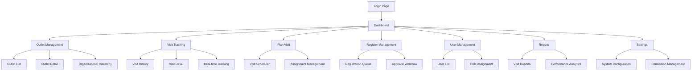

# Web SAM - Product Requirements Document

## 1. Product Overview
Web SAM (Sales Activity Management) adalah sistem manajemen aktivitas sales berbasis web yang dirancang untuk mengelola operasional tim sales di lapangan dengan hierarki organisasi yang terstruktur.

Sistem ini memecahkan masalah koordinasi dan monitoring aktivitas sales dengan menyediakan platform terpusat untuk tracking kunjungan, manajemen outlet, dan approval workflow. Target pengguna adalah tim sales dari berbagai level (ASM, ASC, DSF/DM) dan admin yang membutuhkan visibilitas real-time terhadap aktivitas lapangan.

Produk ini menargetkan peningkatan efisiensi operasional sales hingga 70-90% melalui optimisasi performa dan otomatisasi workflow approval.

## 2. Core Features

### 2.1 User Roles

| Role | Registration Method | Core Permissions |
|------|---------------------|------------------|
| SUPER ADMIN | Admin assignment | Full access ke Filament admin panel, manage semua data |
| ASM (Area Sales Manager) | Admin assignment | Akses semua outlet di division & badan usaha |
| ASC (Area Sales Coordinator) | Admin assignment | Akses outlet di region + division + badan usaha |
| DSF/DM (District Sales Field/Manager) | Admin assignment | Akses outlet di cluster(s) + region + division + badan usaha |

### 2.2 Feature Module

Aplikasi Web SAM terdiri dari halaman-halaman utama berikut:
1. **Dashboard**: overview aktivitas, statistik kunjungan, performance metrics
2. **Outlet Management**: daftar outlet, detail outlet, hierarki organisasi
3. **Visit Tracking**: history kunjungan, detail visit dengan foto dan laporan
4. **Plan Visit**: penjadwalan kunjungan, calendar view, assignment
5. **Register/Lead Management**: approval workflow outlet baru, status tracking
6. **User Management**: manajemen user, role assignment, organizational scope
7. **Reports**: laporan kunjungan, export data, analytics
8. **Settings**: konfigurasi sistem, role permissions, organizational hierarchy

### 2.3 Page Details

| Page Name | Module Name | Feature description |
|-----------|-------------|---------------------|
| Dashboard | Overview Statistics | Display total visits, outlets, pending registrations dengan filter berdasarkan role |
| Dashboard | Performance Metrics | Show visit duration, completion rates, monthly trends |
| Outlet Management | Outlet List | Browse outlets dengan filter hierarki organisasi, search, pagination |
| Outlet Management | Outlet Detail | View outlet information, visit history, location mapping |
| Outlet Management | Organizational Hierarchy | Manage BadanUsaha → Division → Region → Cluster structure |
| Visit Tracking | Visit History | List semua kunjungan dengan filter tanggal, user, outlet |
| Visit Tracking | Visit Detail | View check-in/out times, photos, reports, duration calculation |
| Visit Tracking | Real-time Tracking | Monitor active visits, location tracking |
| Plan Visit | Visit Scheduler | Create, edit, delete planned visits dengan calendar interface |
| Plan Visit | Assignment Management | Assign visits to users berdasarkan organizational scope |
| Register/Lead Management | Registration Queue | List pending registrations dengan approval actions |
| Register/Lead Management | Approval Workflow | PENDING → CONFIRM → APPROVED/REJECTED flow dengan notifications |
| User Management | User List | Manage users dengan role-based filtering dan organizational scope |
| User Management | Role Assignment | Assign roles dan set organizational boundaries |
| Reports | Visit Reports | Generate laporan kunjungan dengan export Excel/PDF |
| Reports | Performance Analytics | Analyze visit patterns, user performance, outlet coverage |
| Settings | System Configuration | Manage application settings, cache configuration |
| Settings | Permission Management | Configure role permissions dan access control |

## 3. Core Process

**Admin Flow:**
Admin mengelola master data organisasi, user management, dan monitoring overall system performance. Admin dapat mengakses semua fitur melalui Filament admin panel.

**Sales Manager Flow (ASM/ASC):**
Manager melakukan planning visit, monitoring tim, dan approval register. Akses data berdasarkan scope organisasi (division/region).

**Field Sales Flow (DSF/DM):**
Field sales melakukan check-in/out via mobile app, submit laporan kunjungan, dan register outlet baru. Data tersinkronisasi dengan web system.

## 4. User Interface Design

### 4.1 Design Style
- **Primary Colors**: Blue (#3B82F6) untuk primary actions, Gray (#6B7280) untuk secondary
- **Secondary Colors**: Green (#10B981) untuk success states, Red (#EF4444) untuk errors
- **Button Style**: Rounded corners (8px), solid fills dengan hover effects
- **Font**: Inter atau system fonts, sizes 14px (body), 16px (headings), 12px (captions)
- **Layout Style**: Card-based design dengan clean spacing, top navigation dengan sidebar
- **Icons**: Heroicons atau Feather icons untuk konsistensi, minimal dan clean

### 4.2 Page Design Overview

| Page Name | Module Name | UI Elements |
|-----------|-------------|-------------|
| Dashboard | Overview Cards | Grid layout dengan 4 kolom cards, blue accent colors, shadow effects |
| Dashboard | Charts Section | Line charts dan bar charts dengan responsive design |
| Outlet Management | Data Table | Striped table dengan search bar, pagination, action buttons |
| Outlet Management | Filter Panel | Dropdown filters untuk hierarki organisasi, collapsible design |
| Visit Tracking | Timeline View | Vertical timeline dengan photo thumbnails, status badges |
| Visit Tracking | Map Integration | Interactive map dengan outlet markers, visit routes |
| Plan Visit | Calendar Interface | Monthly/weekly calendar view dengan drag-drop functionality |
| Register Management | Approval Cards | Card layout dengan status badges, action buttons (Approve/Reject) |
| User Management | Form Layout | Two-column form layout dengan role selection dropdowns |
| Reports | Export Controls | Button group untuk export options, date range pickers |

### 4.3 Responsiveness
Aplikasi dirancang desktop-first dengan mobile-adaptive layout. Menggunakan Tailwind CSS responsive breakpoints (sm, md, lg, xl) untuk optimal viewing di berbagai device sizes. Touch interaction optimization untuk mobile users yang mengakses via browser.