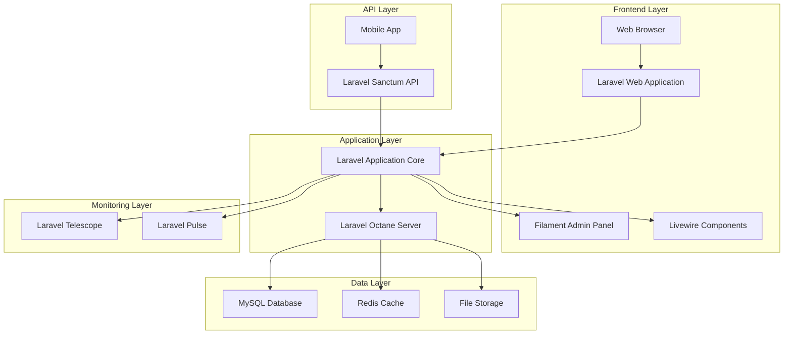
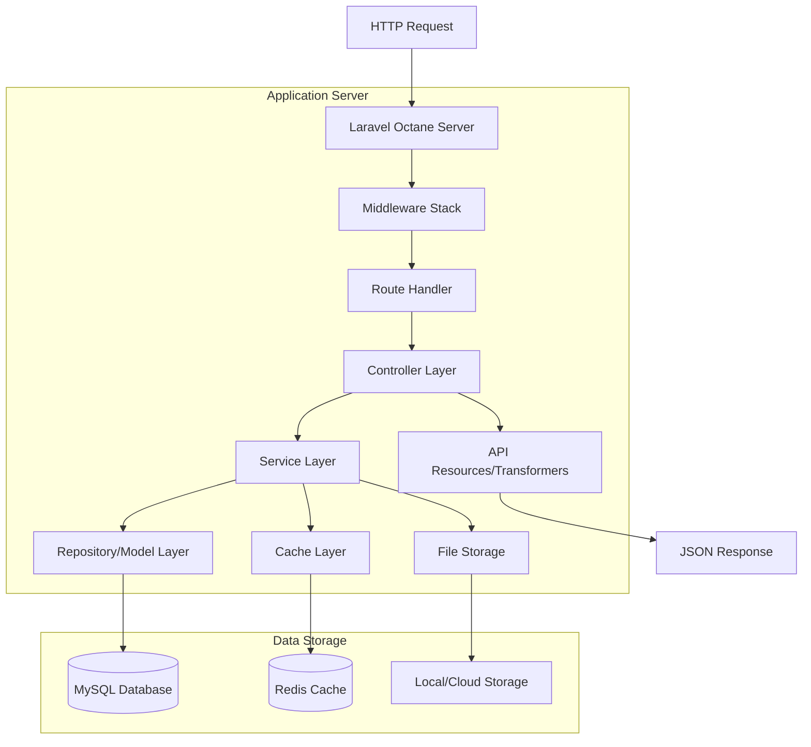
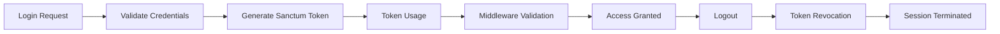

# Web SAM - Technical Architecture Document

## 1. Architecture Design



## 2. Technology Description

* **Frontend**: Livewire 3.6.4 + Alpine.js + Tailwind CSS 3.4.17 + Filament 3.3.39

* **Backend**: Laravel 10.49.0 + Laravel Octane 2.12.2

* **Database**: MySQL dengan Redis untuk caching

* **Authentication**: Laravel Fortify 1.30.0 + Laravel Sanctum 3.3.3 untuk API tokens

* **Monitoring**: Laravel Telescope 5.11.4 + Laravel Pulse 1.4.3

* **Night Mode**: Laravel Nightwatch 1.13.7 for dark mode support

* **Testing**: PHPUnit 10.5.55

* **Code Quality**: Laravel Pint 1.25.1

* **Development**: Laravel Sail 1.45.0, Laravel MCP 0.2.0

* **Asset Building**: Vite

## 3. Route Definitions

### 3.1 Web Routes

| Route        | Method | Purpose                                 |
| ------------ | ------ | --------------------------------------- |
| /            | GET    | Halaman utama                           |
| /login       | POST   | Login dengan Laravel Fortify            |
| /register    | POST   | Registrasi user baru                    |
| /logout      | POST   | Logout user                             |
| /pulse       | GET    | Laravel Pulse monitoring                |
| /telescope   | GET    | Laravel Telescope monitoring            |
| /admin/\*    | GET    | Filament admin panel (Super Admin only) |
| /admin/\*    | POST   | Filament CRUD operations                |
| /livewire/\* | POST   | Livewire component interactions         |

### 3.2 API Routes

#### 3.2.1 Authentication Routes

| Route          | Method | Purpose             | Middleware     |
| -------------- | ------ | ------------------- | -------------- |
| api/user/login | POST   | User authentication | throttle:login |

#### 3.2.2 Protected Routes (Sanctum + Logku Middleware)

| Route                       | Method | Purpose                     | Auth Required |
| --------------------------- | ------ | --------------------------- | ------------- |
| api/logout                  | POST   | User logout                 | ✓             |
| api/user                    | GET    | Get current user info       | ✓             |
| api/outlet                  | GET    | Fetch outlets               | ✓             |
| api/outlet/{nama}           | GET    | Get single outlet           | ✓             |
| api/outlet                  | POST   | Update outlet photo         | ✓             |
| api/visit                   | GET    | Fetch visits                | ✓             |
| api/visit/check             | GET    | Check visit status          | ✓             |
| api/visit                   | POST   | Submit visit                | ✓             |
| api/visit/monitor           | GET    | Visit monitoring            | ✓             |
| api/planvisit               | GET    | Fetch plan visits           | ✓             |
| api/planvisit               | POST   | Add plan visit              | ✓             |
| api/planvisit/filter        | GET    | Filter plan visits by month | ✓             |
| api/planvisit               | DELETE | Delete plan visit           | ✓             |
| api/planvisitrealme         | DELETE | Delete plan visit (RealMe)  | ✓             |
| api/register/getbu          | GET    | Get badan usaha options     | ✓             |
| api/register/getdiv         | GET    | Get division options        | ✓             |
| api/register/getreg         | GET    | Get region options          | ✓             |
| api/register/getclus        | GET    | Get cluster options         | ✓             |
| api/register                | POST   | Submit register             | ✓             |
| api/register/all            | GET    | Get all registers           | ✓             |
| api/register                | GET    | Fetch registers             | ✓             |
| api/register/{kodeOutlet}   | GET    | Get single register         | ✓             |
| api/register/outlet-options | GET    | Get register outlet options | ✓             |
| api/register/confirm        | POST   | Confirm register            | ✓             |
| api/register/approved       | POST   | Approve register            | ✓             |
| api/register/reject         | POST   | Reject register             | ✓             |
| api/lead                    | POST   | Create lead                 | ✓             |
| api/lead/update             | POST   | Update lead                 | ✓             |

#### 3.2.3 Public Routes

| Route      | Method | Purpose            |
| ---------- | ------ | ------------------ |
| api/divisi | GET    | Get divisions      |
| api/region | GET    | Get regions        |
| api/notif  | POST   | Send notifications |

#### 3.2.4 Sync API Routes (Throttle: Expensive)

| Route                         | Method | Purpose                        |
| ----------------------------- | ------ | ------------------------------ |
| api/sync/badanusaha           | GET    | Sync badan usaha data          |
| api/sync/division             | GET    | Sync division data             |
| api/sync/region               | GET    | Sync region data               |
| api/sync/cluster              | GET    | Sync cluster data              |
| api/sync/role                 | GET    | Sync role data                 |
| api/sync/user                 | GET    | Sync user data                 |
| api/sync/outlet               | GET    | Sync outlet data               |
| api/sync/outlet/reset         | POST   | Reset outlet sync              |
| api/sync/visit                | GET    | Sync visit data                |
| api/sync/planvisit            | GET    | Sync plan visit data           |
| api/sync/visit/create         | POST   | Create visit via sync          |
| api/sync/visit/instant        | POST   | Create instant visit           |
| api/sync/visit/instant-delete | POST   | Delete instant duplicate visit |

#### 3.2.5 Documentation Routes

| Route         | Method | Purpose                |
| ------------- | ------ | ---------------------- |
| docs/api      | GET    | API documentation UI   |
| docs/api.json | GET    | API documentation JSON |

## 4. API Definitions

### 4.1 Core API

**Authentication**

```
POST /api/user/login
```

Request:

| Param Name | Param Type | isRequired | Description           |
| ---------- | ---------- | ---------- | --------------------- |
| username   | string     | true       | Username untuk login  |
| password   | string     | true       | Password (plain text) |

Response:

| Param Name | Param Type | Description                                    |
| ---------- | ---------- | ---------------------------------------------- |
| token      | string     | Sanctum API token                              |
| user       | object     | User data dengan role dan organizational scope |

**Visit Tracking**

```
POST /api/visit
POST /api/sync/visit/create
```

Request:

| Param Name          | Param Type | isRequired | Description                 |
| ------------------- | ---------- | ---------- | --------------------------- |
| outlet\_id          | integer    | true       | ID outlet yang dikunjungi   |
| tanggal\_visit      | datetime   | true       | Tanggal dan waktu kunjungan |
| tipe\_visit         | string     | true       | Tipe kunjungan              |
| latitude            | float      | true       | Koordinat latitude          |
| longitude           | float      | true       | Koordinat longitude         |
| picture\_visit\_in  | file       | false      | Foto check-in               |
| picture\_visit\_out | file       | false      | Foto check-out              |
| laporan\_visit      | string     | false      | Laporan kunjungan           |

Response:

| Param Name | Param Type | Description                     |
| ---------- | ---------- | ------------------------------- |
| status     | boolean    | Status operasi                  |
| message    | string     | Pesan response                  |
| data       | object     | Data visit yang dibuat/diupdate |

**Sync API**

```
GET /api/sync/{resource}
```

Request:

| Param Name | Param Type | isRequired | Description                                  |
| ---------- | ---------- | ---------- | -------------------------------------------- |
| resource   | string     | true       | Resource type (outlets, users, visits, etc.) |
| last\_sync | timestamp  | false      | Timestamp untuk incremental sync             |

Response:

| Param Name | Param Type | Description                      |
| ---------- | ---------- | -------------------------------- |
| data       | array      | Array data sesuai resource       |
| timestamp  | timestamp  | Server timestamp untuk next sync |

**Register/Lead Submission**

```
POST /api/register
POST /api/lead
```

Request:

| Param Name   | Param Type | isRequired | Description         |
| ------------ | ---------- | ---------- | ------------------- |
| nama\_outlet | string     | true       | Nama outlet         |
| alamat       | string     | true       | Alamat outlet       |
| latitude     | float      | true       | Koordinat latitude  |
| longitude    | float      | true       | Koordinat longitude |
| cluster\_id  | integer    | true       | ID cluster          |
| foto\_outlet | file       | true       | Foto outlet         |

Response:

| Param Name   | Param Type | Description             |
| ------------ | ---------- | ----------------------- |
| status       | boolean    | Status submission       |
| message      | string     | Pesan response          |
| register\_id | integer    | ID register yang dibuat |

**Register Management**

```
POST /api/register/approved
POST /api/register/reject
POST /api/register/confirm
GET /api/register
GET /api/register/all
GET /api/register/{kodeOutlet}
```

**Outlet Management**

```
GET /api/outlet
GET /api/outlet/{nama}
POST /api/outlet
```

**Plan Visit Management**

```
GET /api/planvisit
POST /api/planvisit
DELETE /api/planvisit
GET /api/planvisit/filter
```

**Push Notifications**

```
POST /api/notif
```

## 5. Server Architecture Diagram



## 6. Data Model

### 6.1 Data Model Definition

```mermaid
erDiagram
    BADAN_USAHA ||--o{ DIVISION : contains
    DIVISION ||--o{ REGION : contains
    REGION ||--o{ CLUSTER : contains
    CLUSTER ||--o{ OUTLET : contains

    BADAN_USAHA ||--o{ USER : belongs_to
    DIVISION ||--o{ USER : belongs_to
    REGION ||--o{ USER : belongs_to
    CLUSTER ||--o{ USER : belongs_to

    ROLE ||--o{ USER : has
    ROLE ||--o{ ROLE_PERMISSION : has
    PERMISSION ||--o{ ROLE_PERMISSION : belongs_to
    USER ||--o{ VISIT : performs
    USER ||--o{ PLAN_VISIT : creates
    USER ||--o{ REGISTER : submits_as_TM

    BADAN_USAHA ||--o{ REGISTER : belongs_to
    DIVISION ||--o{ REGISTER : belongs_to
    REGION ||--o{ REGISTER : belongs_to
    CLUSTER ||--o{ REGISTER : belongs_to

    OUTLET ||--o{ VISIT : receives
    OUTLET ||--o{ PLAN_VISIT : scheduled_for

    BADAN_USAHA {
        uuid id PK
        string name
        string code
        timestamp created_at
        timestamp updated_at
        timestamp deleted_at
    }

    DIVISION {
        uuid id PK
        uuid badanusaha_id FK
        string name
        string code
        timestamp created_at
        timestamp updated_at
        timestamp deleted_at
    }

    REGION {
        uuid id PK
        uuid badanusaha_id FK
        uuid divisi_id FK
        string name
        string code
        timestamp created_at
        timestamp updated_at
        timestamp deleted_at
    }

    CLUSTER {
        uuid id PK
        uuid badanusaha_id FK
        uuid divisi_id FK
        uuid region_id FK
        string name
        string code
        timestamp created_at
        timestamp updated_at
        timestamp deleted_at
    }

    OUTLET {
        bigint id PK
        bigint badanusaha_id FK
        bigint divisi_id FK
        bigint region_id FK
        bigint cluster_id FK
        string kode_outlet
        string nama_outlet
        text alamat_outlet
        string nama_pemilik_outlet
        string nomer_tlp_outlet
        string distric
        string poto_shop_sign
        string poto_depan
        string poto_kiri
        string poto_kanan
        string poto_ktp
        string video
        integer limit
        integer radius
        string latlong
        enum status_outlet
        enum is_member
        timestamp created_at
        timestamp updated_at
        timestamp deleted_at
    }

    USER {
        bigint id PK
        bigint role_id FK
        bigint badanusaha_id FK
        bigint divisi_id FK
        bigint region_id FK
        bigint cluster_id FK
        bigint cluster_id2 FK
        bigint tm_id FK
        string username
        string nama_lengkap
        string email
        string password
        text two_factor_secret
        text two_factor_recovery_codes
        string id_notif
        string remember_token
        string profile_photo_path
        timestamp created_at
        timestamp updated_at
        timestamp deleted_at
    }

    ROLE {
        bigint id PK
        string name
        boolean can_access_web
        enum filter_type
        json filter_data
        timestamp created_at
        timestamp updated_at
        timestamp deleted_at
    }

    PERMISSION {
        bigint id PK
        string name
        text description
        timestamp created_at
        timestamp updated_at
    }

    ROLE_PERMISSION {
        bigint id PK
        bigint role_id FK
        bigint permission_id FK
        timestamp created_at
        timestamp updated_at
    }

    VISIT {
        bigint id PK
        bigint user_id FK
        bigint outlet_id FK
        timestamp tanggal_visit
        string tipe_visit
        string latlong_in
        string latlong_out
        timestamp check_in_time
        timestamp check_out_time
        enum transaksi
        integer durasi_visit
        text picture_visit_in
        text picture_visit_out
        text laporan_visit
        timestamp created_at
        timestamp updated_at
        timestamp deleted_at
    }

    PLAN_VISIT {
        bigint id PK
        bigint user_id FK
        bigint outlet_id FK
        timestamp tanggal_visit
        timestamp created_at
        timestamp updated_at
        timestamp deleted_at
    }

    REGISTER {
        bigint id PK
        string kode_outlet
        bigint badanusaha_id FK
        bigint divisi_id FK
        bigint region_id FK
        bigint cluster_id FK
        bigint tm_id FK
        string nama_outlet
        text alamat_outlet
        string nama_pemilik_outlet
        string nomer_tlp_outlet
        string nomer_wakil_outlet
        string ktp_outlet
        string distric
        string poto_shop_sign
        string poto_depan
        string poto_kiri
        string poto_kanan
        string poto_ktp
        string video
        string oppo
        string vivo
        string realme
        string samsung
        string xiaomi
        string fl
        string latlong
        bigint limit
        enum status
        string created_by
        timestamp rejected_at
        string rejected_by
        timestamp confirmed_at
        string confirmed_by
        timestamp approved_at
        string approved_by
        text keterangan
        timestamp created_at
        timestamp updated_at
        timestamp deleted_at
    }
```



### 6.2 Data Definition Language

**Organizational Hierarchy Tables**

```sql
-- Badan Usaha Table
CREATE TABLE badan_usahas (
    id BIGINT UNSIGNED AUTO_INCREMENT PRIMARY KEY,
    name VARCHAR(255) NOT NULL,
    code VARCHAR(50) UNIQUE NOT NULL,
    created_at TIMESTAMP DEFAULT CURRENT_TIMESTAMP,
    updated_at TIMESTAMP DEFAULT CURRENT_TIMESTAMP ON UPDATE CURRENT_TIMESTAMP,
    deleted_at TIMESTAMP NULL
);

-- Division Table
CREATE TABLE divisions (
    id BIGINT UNSIGNED AUTO_INCREMENT PRIMARY KEY,
    badanusaha_id BIGINT UNSIGNED NOT NULL,
    name VARCHAR(255) NOT NULL,
    code VARCHAR(50) NOT NULL,
    created_at TIMESTAMP DEFAULT CURRENT_TIMESTAMP,
    updated_at TIMESTAMP DEFAULT CURRENT_TIMESTAMP ON UPDATE CURRENT_TIMESTAMP,
    deleted_at TIMESTAMP NULL,
    FOREIGN KEY (badanusaha_id) REFERENCES badan_usahas(id) ON UPDATE CASCADE ON DELETE RESTRICT
);

-- Region Table
CREATE TABLE regions (
    id BIGINT UNSIGNED AUTO_INCREMENT PRIMARY KEY,
    badanusaha_id BIGINT UNSIGNED NOT NULL,
    divisi_id BIGINT UNSIGNED NOT NULL,
    name VARCHAR(255) NOT NULL,
    code VARCHAR(50) NOT NULL,
    created_at TIMESTAMP DEFAULT CURRENT_TIMESTAMP,
    updated_at TIMESTAMP DEFAULT CURRENT_TIMESTAMP ON UPDATE CURRENT_TIMESTAMP,
    deleted_at TIMESTAMP NULL,
    FOREIGN KEY (badanusaha_id) REFERENCES badan_usahas(id) ON UPDATE CASCADE ON DELETE RESTRICT,
    FOREIGN KEY (divisi_id) REFERENCES divisions(id) ON UPDATE CASCADE ON DELETE RESTRICT
);

-- Cluster Table
CREATE TABLE clusters (
    id BIGINT UNSIGNED AUTO_INCREMENT PRIMARY KEY,
    badanusaha_id BIGINT UNSIGNED NOT NULL,
    divisi_id BIGINT UNSIGNED NOT NULL,
    region_id BIGINT UNSIGNED NOT NULL,
    name VARCHAR(255) NOT NULL,
    code VARCHAR(50) NOT NULL,
    created_at TIMESTAMP DEFAULT CURRENT_TIMESTAMP,
    updated_at TIMESTAMP DEFAULT CURRENT_TIMESTAMP ON UPDATE CURRENT_TIMESTAMP,
    deleted_at TIMESTAMP NULL,
    FOREIGN KEY (badanusaha_id) REFERENCES badan_usahas(id) ON UPDATE CASCADE ON DELETE RESTRICT,
    FOREIGN KEY (divisi_id) REFERENCES divisions(id) ON UPDATE CASCADE ON DELETE RESTRICT,
    FOREIGN KEY (region_id) REFERENCES regions(id) ON UPDATE CASCADE ON DELETE RESTRICT
);
```

**Core Business Tables**

```sql
-- Outlet Table
CREATE TABLE outlets (
    id BIGINT UNSIGNED AUTO_INCREMENT PRIMARY KEY,
    badanusaha_id BIGINT UNSIGNED NOT NULL,
    divisi_id BIGINT UNSIGNED NOT NULL,
    region_id BIGINT UNSIGNED NOT NULL,
    cluster_id BIGINT UNSIGNED NOT NULL,
    kode_outlet VARCHAR(50) UNIQUE NOT NULL,
    nama_outlet VARCHAR(255) NOT NULL,
    alamat_outlet TEXT NOT NULL,
    nama_pemilik_outlet VARCHAR(255) NULL,
    nomer_tlp_outlet VARCHAR(255) NULL,
    distric VARCHAR(255) NOT NULL,
    poto_shop_sign VARCHAR(255) NULL,
    poto_depan VARCHAR(255) NULL,
    poto_kiri VARCHAR(255) NULL,
    poto_kanan VARCHAR(255) NULL,
    poto_ktp VARCHAR(255) NULL,
    video VARCHAR(255) NULL,
    limit_field INT NULL,
    radius INT NULL,
    latlong VARCHAR(255) NULL,
    status_outlet ENUM('MAINTAIN', 'UNMAINTAIN', 'UNPRODUCTIVE'),
    is_member ENUM('0', '1') DEFAULT '1',
    created_at TIMESTAMP DEFAULT CURRENT_TIMESTAMP,
    updated_at TIMESTAMP DEFAULT CURRENT_TIMESTAMP ON UPDATE CURRENT_TIMESTAMP,
    deleted_at TIMESTAMP NULL,
    FOREIGN KEY (badanusaha_id) REFERENCES badan_usahas(id) ON UPDATE CASCADE ON DELETE RESTRICT,
    FOREIGN KEY (divisi_id) REFERENCES divisions(id) ON UPDATE CASCADE ON DELETE RESTRICT,
    FOREIGN KEY (region_id) REFERENCES regions(id) ON UPDATE CASCADE ON DELETE RESTRICT,
    FOREIGN KEY (cluster_id) REFERENCES clusters(id) ON UPDATE CASCADE ON DELETE RESTRICT
);

-- User Table
CREATE TABLE users (
    id BIGINT UNSIGNED AUTO_INCREMENT PRIMARY KEY,
    role_id BIGINT UNSIGNED NOT NULL,
    badanusaha_id BIGINT UNSIGNED NOT NULL,
    divisi_id BIGINT UNSIGNED NOT NULL,
    region_id BIGINT UNSIGNED NULL,
    cluster_id BIGINT UNSIGNED NULL,
    cluster_id2 BIGINT UNSIGNED NULL,
    tm_id BIGINT UNSIGNED NULL,
    username VARCHAR(100) UNIQUE NOT NULL,
    nama_lengkap VARCHAR(255) NOT NULL,
    email VARCHAR(255) UNIQUE NOT NULL,
    password VARCHAR(255) NOT NULL,
    two_factor_secret TEXT NULL,
    two_factor_recovery_codes TEXT NULL,
    id_notif VARCHAR(255) NULL,
    remember_token VARCHAR(255) NULL,
    profile_photo_path VARCHAR(255) NULL,
    created_at TIMESTAMP DEFAULT CURRENT_TIMESTAMP,
    updated_at TIMESTAMP DEFAULT CURRENT_TIMESTAMP ON UPDATE CURRENT_TIMESTAMP,
    deleted_at TIMESTAMP NULL,
    FOREIGN KEY (role_id) REFERENCES roles(id) ON UPDATE CASCADE ON DELETE RESTRICT,
    FOREIGN KEY (badanusaha_id) REFERENCES badan_usahas(id) ON UPDATE CASCADE ON DELETE RESTRICT,
    FOREIGN KEY (divisi_id) REFERENCES divisions(id) ON UPDATE CASCADE ON DELETE RESTRICT,
    FOREIGN KEY (region_id) REFERENCES regions(id) ON UPDATE CASCADE ON DELETE RESTRICT,
    FOREIGN KEY (cluster_id) REFERENCES clusters(id) ON UPDATE CASCADE ON DELETE RESTRICT,
    FOREIGN KEY (cluster_id2) REFERENCES clusters(id) ON UPDATE CASCADE ON DELETE SET NULL,
    FOREIGN KEY (tm_id) REFERENCES users(id) ON UPDATE CASCADE ON DELETE RESTRICT
);

-- Visit Table
CREATE TABLE visits (
    id BIGINT UNSIGNED AUTO_INCREMENT PRIMARY KEY,
    user_id BIGINT UNSIGNED NOT NULL,
    outlet_id BIGINT UNSIGNED NOT NULL,
    tanggal_visit TIMESTAMP NOT NULL,
    tipe_visit VARCHAR(255) NOT NULL,
    latlong_in VARCHAR(255) NULL,
    latlong_out VARCHAR(255) NULL,
    check_in_time TIMESTAMP NULL,
    check_out_time TIMESTAMP NULL,
    transaksi ENUM('YES', 'NO') NULL,
    durasi_visit INT NULL COMMENT 'Duration in minutes',
    picture_visit_in TEXT NULL,
    picture_visit_out TEXT NULL,
    laporan_visit TEXT NULL,
    created_at TIMESTAMP DEFAULT CURRENT_TIMESTAMP,
    updated_at TIMESTAMP DEFAULT CURRENT_TIMESTAMP ON UPDATE CURRENT_TIMESTAMP,
    deleted_at TIMESTAMP NULL,
    FOREIGN KEY (user_id) REFERENCES users(id) ON UPDATE CASCADE ON DELETE RESTRICT,
    FOREIGN KEY (outlet_id) REFERENCES outlets(id) ON UPDATE CASCADE ON DELETE RESTRICT
);

-- Role Table
CREATE TABLE roles (
    id BIGINT UNSIGNED AUTO_INCREMENT PRIMARY KEY,
    name VARCHAR(255) NOT NULL,
    can_access_web BOOLEAN DEFAULT TRUE,
    filter_type ENUM('badanusaha', 'divisi', 'region', 'cluster', 'all') DEFAULT 'all',
    filter_data JSON NULL,
    created_at TIMESTAMP DEFAULT CURRENT_TIMESTAMP,
    updated_at TIMESTAMP DEFAULT CURRENT_TIMESTAMP ON UPDATE CURRENT_TIMESTAMP,
    deleted_at TIMESTAMP NULL
);

-- Permissions Table
CREATE TABLE permissions (
    id BIGINT UNSIGNED AUTO_INCREMENT PRIMARY KEY,
    name VARCHAR(255) UNIQUE NOT NULL,
    description TEXT NULL,
    created_at TIMESTAMP DEFAULT CURRENT_TIMESTAMP,
    updated_at TIMESTAMP DEFAULT CURRENT_TIMESTAMP ON UPDATE CURRENT_TIMESTAMP
);

-- Role Permissions Junction Table
CREATE TABLE role_permissions (
    id BIGINT UNSIGNED AUTO_INCREMENT PRIMARY KEY,
    role_id BIGINT UNSIGNED NOT NULL,
    permission_id BIGINT UNSIGNED NOT NULL,
    created_at TIMESTAMP DEFAULT CURRENT_TIMESTAMP,
    updated_at TIMESTAMP DEFAULT CURRENT_TIMESTAMP ON UPDATE CURRENT_TIMESTAMP,
    FOREIGN KEY (role_id) REFERENCES roles(id) ON UPDATE CASCADE ON DELETE CASCADE,
    FOREIGN KEY (permission_id) REFERENCES permissions(id) ON UPDATE CASCADE ON DELETE CASCADE
);

-- Plan Visit Table
CREATE TABLE plan_visits (
    id BIGINT UNSIGNED AUTO_INCREMENT PRIMARY KEY,
    user_id BIGINT UNSIGNED NOT NULL,
    outlet_id BIGINT UNSIGNED NOT NULL,
    tanggal_visit TIMESTAMP NOT NULL,
    created_at TIMESTAMP DEFAULT CURRENT_TIMESTAMP,
    updated_at TIMESTAMP DEFAULT CURRENT_TIMESTAMP ON UPDATE CURRENT_TIMESTAMP,
    deleted_at TIMESTAMP NULL,
    FOREIGN KEY (user_id) REFERENCES users(id) ON UPDATE CASCADE ON DELETE RESTRICT,
    FOREIGN KEY (outlet_id) REFERENCES outlets(id) ON UPDATE CASCADE ON DELETE RESTRICT
);

-- Register Table (sebelumnya noos)
CREATE TABLE registers (
    id BIGINT UNSIGNED AUTO_INCREMENT PRIMARY KEY,
    kode_outlet VARCHAR(255) NULL,
    badanusaha_id BIGINT UNSIGNED NOT NULL,
    divisi_id BIGINT UNSIGNED NOT NULL,
    region_id BIGINT UNSIGNED NOT NULL,
    cluster_id BIGINT UNSIGNED NOT NULL,
    tm_id BIGINT UNSIGNED NOT NULL,
    nama_outlet VARCHAR(255) NOT NULL,
    alamat_outlet TEXT NOT NULL,
    nama_pemilik_outlet VARCHAR(255) NOT NULL,
    nomer_tlp_outlet VARCHAR(255) NOT NULL,
    nomer_wakil_outlet VARCHAR(255) NULL,
    ktp_outlet VARCHAR(255) NOT NULL,
    distric VARCHAR(255) NOT NULL,
    poto_shop_sign VARCHAR(255) NOT NULL,
    poto_depan VARCHAR(255) NOT NULL,
    poto_kiri VARCHAR(255) NOT NULL,
    poto_kanan VARCHAR(255) NOT NULL,
    poto_ktp VARCHAR(255) NOT NULL,
    video VARCHAR(255) NOT NULL,
    oppo VARCHAR(255) NOT NULL,
    vivo VARCHAR(255) NOT NULL,
    realme VARCHAR(255) NOT NULL,
    samsung VARCHAR(255) NOT NULL,
    xiaomi VARCHAR(255) NOT NULL,
    fl VARCHAR(255) NOT NULL,
    latlong VARCHAR(255) NULL,
    limit_field BIGINT NULL,
    status ENUM('PENDING', 'CONFIRMED', 'APPROVED', 'REJECTED') DEFAULT 'PENDING',
    created_by VARCHAR(255) NOT NULL,
    rejected_at TIMESTAMP NULL,
    rejected_by VARCHAR(255) NULL,
    confirmed_at TIMESTAMP NULL,
    confirmed_by VARCHAR(255) NULL,
    approved_at TIMESTAMP NULL,
    approved_by VARCHAR(255) NULL,
    keterangan TEXT NULL,
    created_at TIMESTAMP DEFAULT CURRENT_TIMESTAMP,
    updated_at TIMESTAMP DEFAULT CURRENT_TIMESTAMP ON UPDATE CURRENT_TIMESTAMP,
    deleted_at TIMESTAMP NULL,
    FOREIGN KEY (badanusaha_id) REFERENCES badan_usahas(id) ON UPDATE CASCADE ON DELETE RESTRICT,
    FOREIGN KEY (divisi_id) REFERENCES divisions(id) ON UPDATE CASCADE ON DELETE RESTRICT,
    FOREIGN KEY (region_id) REFERENCES regions(id) ON UPDATE CASCADE ON DELETE RESTRICT,
    FOREIGN KEY (cluster_id) REFERENCES clusters(id) ON UPDATE CASCADE ON DELETE RESTRICT,
    FOREIGN KEY (tm_id) REFERENCES users(id) ON UPDATE CASCADE ON DELETE RESTRICT
);
```

**Performance Indexes**

```sql
-- Composite indexes untuk outlets (role-based queries)
CREATE INDEX outlets_bu_div_idx ON outlets(badanusaha_id, divisi_id);
CREATE INDEX outlets_bu_div_reg_idx ON outlets(badanusaha_id, divisi_id, region_id);
CREATE INDEX outlets_bu_div_reg_clus_idx ON outlets(badanusaha_id, divisi_id, region_id, cluster_id);
CREATE INDEX outlets_deleted_bu_idx ON outlets(deleted_at, badanusaha_id);
CREATE INDEX outlets_updated_deleted_idx ON outlets(updated_at, deleted_at);

-- Composite indexes untuk users (role-based queries)
CREATE INDEX users_bu_div_idx ON users(badanusaha_id, divisi_id);
CREATE INDEX users_bu_div_reg_idx ON users(badanusaha_id, divisi_id, region_id);
CREATE INDEX users_bu_div_reg_clus_idx ON users(badanusaha_id, divisi_id, region_id, cluster_id);
CREATE INDEX users_deleted_role_idx ON users(deleted_at, role_id);
CREATE INDEX users_updated_deleted_idx ON users(updated_at, deleted_at);

-- Composite indexes untuk registers (sebelumnya noos)
CREATE INDEX registers_bu_div_idx ON registers(badanusaha_id, divisi_id);
CREATE INDEX registers_bu_div_reg_idx ON registers(badanusaha_id, divisi_id, region_id);
CREATE INDEX registers_bu_div_reg_clus_idx ON registers(badanusaha_id, divisi_id, region_id, cluster_id);
CREATE INDEX registers_status_deleted_idx ON registers(status, deleted_at);

-- Indexes untuk visits (monitoring queries)
CREATE INDEX visits_user_date_idx ON visits(user_id, tanggal_visit);
CREATE INDEX visits_outlet_date_idx ON visits(outlet_id, tanggal_visit);
CREATE INDEX visits_deleted_date_idx ON visits(deleted_at, tanggal_visit);
CREATE INDEX visits_updated_deleted_idx ON visits(updated_at, deleted_at);

-- Indexes untuk plan_visits (scheduling queries)
CREATE INDEX plan_visits_user_date_idx ON plan_visits(user_id, tanggal_visit);
CREATE INDEX plan_visits_outlet_date_idx ON plan_visits(outlet_id, tanggal_visit);
CREATE INDEX plan_visits_deleted_date_idx ON plan_visits(deleted_at, tanggal_visit);
CREATE INDEX plan_visits_updated_deleted_idx ON plan_visits(updated_at, deleted_at);
```

**Initial Data**

```sql
-- Insert default roles
INSERT INTO roles (name, filter_type, can_access_web, created_at, updated_at) VALUES
('SUPER ADMIN', 'all', 1, NOW(), NOW()),
('ASM', 'division', 1, NOW(), NOW()),
('ASC', 'region', 1, NOW(), NOW()),
('DSF/DM', 'cluster', 1, NOW(), NOW());

-- Insert sample organizational data
INSERT INTO badan_usahas (name, code, created_at, updated_at) VALUES
('PT Complete Selular', 'CS001', NOW(), NOW());
```

## 7. Application Structure

### 7.1 Directory Structure

```
web-sam/
├── app/
│   ├── Console/
│   ├── Exceptions/
│   ├── Filament/           # Filament admin panel resources
│   │   ├── Exports/        # Data export functionality
│   │   ├── Pages/          # Custom pages
│   │   └── Resources/      # CRUD resources
│   ├── Http/
│   │   ├── Controllers/    # Web controllers
│   │   └── Middleware/
│   ├── Models/             # Eloquent models
│   ├── Policies/           # Authorization policies
│   ├── Providers/          # Service providers
│   ├── Services/           # Business logic services
│   │   ├── OrganizationalCacheService.php
│   │   └── FileUploadService.php
│   └── Traits/             # Reusable model traits
│       └── HasOrganizationalScope.php
├── app/Helpers/            # Utility classes
│   ├── ResponseFormatter.php
│   └── SendNotif.php
├── app/Support/            # Support classes
│   ├── StorageDisk.php
│   └── StoragePathResolver.php
├── app/Jobs/               # Background jobs
│   └── ProcessVisitMedia.php
├── database/
│   ├── factories/          # Model factories
│   ├── migrations/         # Database migrations
│   └── seeders/            # Database seeders
├── routes/
│   ├── api.php            # API routes
│   ├── console.php        # Console routes
│   └── web.php            # Web routes
├── resources/
│   ├── views/             # Blade templates
│   └── js/                # JavaScript assets
└── tests/                 # PHPUnit tests
```

### 7.2 Key Features

**Role-Based Access Control (RBAC)**

* Hierarchical organizational filtering

* Role-specific data access patterns

* Permissions system integration

**Multi-tenant Architecture**

* Organizational data isolation

* Soft deletes implementation

* Audit trails and timestamps

**Mobile API Support**

* RESTful API endpoints

* Sanctum authentication

* Media file handling

**Admin Panel**

* Filament-based admin interface

* Data export capabilities

* Real-time monitoring

* Automatic Duration Calculation - Visit duration automatically calculated from check-in/check-out times

**Custom Middleware**

* **LogRoute Middleware**: Automatic API logging for non-200 responses

* **IsAdmin Middleware**: Admin access control for protected routes

* **Organizational Scoping**: Automatic data filtering based on user hierarchy

**API Response Structure**

All API responses follow a consistent format using ResponseFormatter:

```json
{
  "meta": {
    "code": 200,
    "status": "success|error",
    "message": "Response message"
  },
  "data": { /* Response data */ }
}
```

**Service Layer Architecture**

* **OrganizationalCacheService**: Tag-based caching for hierarchical data

* **FileUploadService**: Centralized file handling with validation

* **HasOrganizationalScope Trait**: Reusable data access patterns

* **Media Processing**: Automatic file cleanup on updates and background job processing

## 8. Security Implementation

### 8.1 Authentication & Authorization

* **Laravel Fortify**: Password-based authentication

* **Laravel Sanctum**: API token authentication

* **Two-Factor Authentication**: Enhanced security for admin users

* **Role-Based Permissions**: Granular access control

### 8.2 Data Protection

* **Soft Deletes**: Data retention with logical deletion

* **Input Validation**: Request validation rules

* **CSRF Protection**: Cross-site request forgery prevention

* **SQL Injection Prevention**: Eloquent ORM usage

### 8.3 Organizational Security

* **Data Scoping**: Role-based data access patterns

* **Hierarchical Filtering**: Multi-level organizational filtering

* **Foreign Key Constraints**: Referential integrity enforcement

## 9. Performance Optimization

### 9.1 Database Optimization

* **Composite Indexes**: Multi-column indexes for common queries

* **Soft Delete Indexing**: Optimized soft delete queries

* **Query Optimization**: Eager loading and relationship caching

### 9.2 Application Performance

* **Laravel Octane**: High-performance server

* **Redis Caching**: Query result caching

* **Lazy Loading**: Optimized resource loading

* **Database Connection Pooling**: Connection reuse

## 10. Monitoring & Debugging

### 10.1 Application Monitoring

* **Laravel Telescope**: Request and query monitoring

* **Laravel Pulse**: Performance metrics

* **Browser Logging**: Frontend error tracking

* **Log Management**: Structured logging

### 10.2 Development Tools

* **Laravel Pint**: Code formatting

* **PHPUnit**: Unit and feature testing

* **Laravel MCP**: Development automation

* **Git Version Control**: Source code management

## 11. Deployment & Infrastructure

### 11.1 Environment Requirements

* **PHP**: 8.4.13+

* **Laravel**: 10.49.0

* **Database**: MySQL 8.0+

* **Cache**: Redis 6.0+

* **Web Server**: Apache/Nginx with PHP-FPM

### 11.2 Production Considerations

* **Environment Variables**: Secure configuration management

* **File Storage**: Local/cloud storage configuration

* **Queue System**: Background job processing

* **SSL/TLS**: HTTPS encryption

* **Regular Backups**: Database and file backups

````

## 12. Business Logic & Workflow

### 12.1 Register/Lead Management Workflow

```mermaid
graph LR
    A[Lead Submission] --> B[Pending Review]
    B --> C[Confirmation]
    C --> D[Approval]
    D --> E[Outlet Creation]

    A --> F[Mobile App]
    B --> G[TM Review]
    C --> H[ASM Review]
    D --> I[Final Approval]
    E --> J[Auto-Create]
````

**Status Flow:**

1. **PENDING** - Lead submitted by field agent
2. **CONFIRMED** - Reviewed and confirmed by TM (Territory Manager)
3. **APPROVED** - Final approval by ASM/ASC
4. **REJECTED** - Lead rejected at any stage

**Auto-Creation Feature:**

* When register status changes to **APPROVED**, system automatically creates an outlet

* Outlet gets assigned `is_member = true` and `status_outlet = 'MAINTAIN'`

* Photo and location data copied from register to outlet

### 12.2 Visit Management Workflow

```mermaid
graph LR
    A[Planning] --> B[Check-in]
    B --> C[Activity]
    C --> D[Check-out]
    D --> E[Reporting]

    A --> F[Schedule]
    B --> G[Location]
    C --> H[Photos/Videos]
    D --> I[Location]
    E --> J[Visit Report]
```

**Visit Types:**

* **Regular Visit** - Scheduled outlet visits

* **Instant Visit** - Unscheduled visits via sync API

* **Monitoring Visit** - Supervisory visits

**Special User Access Patterns:**

* **Robby (GM ZTE)**: User ID 2, Role ID 8 - Filters ZTE division visits (divisi\_id: 8) in specific regions

* **Hendra Setia (GM Techno)**: User ID 689, Role ID 8 - Filters Techno division visits (divisi\_id: 11)

**Role-Based Visit Monitoring:**

* **ASM/RKAM (role\_id: 1, 9)**: Monitors users under their TM hierarchy

* **COO (role\_id: 6)**: Global access to all visits

* **CSO (role\_id: 8)**: Limited to division\_id: 4 visits

* **CSO FAST EV (role\_id: 11)**: Limited to division\_id: 7 visits

* **Default**: Region-based filtering matching user's region

### 12.3 Organizational Data Access Patterns

**Role-Based Filtering:**

* **SUPER ADMIN** - Access to all data (filter\_type: 'all')

* **ASM** - Access to division level (filter\_type: 'division')

* **ASC** - Access to region level (filter\_type: 'region')

* **DSF/DM** - Access to cluster level (filter\_type: 'cluster')

**Multi-Cluster Support:**

* DSF/DM users can have `cluster_id` and `cluster_id2`

* System combines data from both clusters for data access

### 12.4 Data Synchronization Strategy

**Sync API Features:**

* Incremental sync based on timestamps

* Throttled to prevent abuse (expensive middleware)

* Support for data reset operations

* Real-time visit creation via sync API

**Offline Support:**

* Mobile apps can cache data for offline use

* Conflict resolution for duplicate visits

* Automatic data synchronization when online

## 13. Security Implementation Details

### 13.1 Authentication Flow



### 13.2 Authorization Patterns

**Organizational Scoping:**

* `HasOrganizationalScope` trait applied to relevant models

* Automatic data filtering based on user's organizational level

* Soft delete support with proper scoping

**Permission System:**

* Role-based permissions with granular control

* Junction table for many-to-many role-permission relationships

* Dynamic permission loading through model relationships

### 13.3 Data Protection Measures

* **File Upload Security** - Validated file types and sizes

* **SQL Injection Prevention** - Eloquent ORM usage throughout

* **CSRF Protection** - Built-in Laravel CSRF tokens

* **Rate Limiting** - Login attempts and sync API throttling

* **Input Validation** - Form request validation for all inputs

***

## 14. Documentation & Maintenance

### 14.1 Version Control

* **Git Repository** - All code under version control

* **Migration Files** - Database schema versioning

* **Semantic Versioning** - Following conventional versioning

### 14.2 Code Standards

* **Laravel Conventions** - Following framework best practices

* **PHP Standards** - PSR-12 coding standards

* **Code Quality** - Laravel Pint for code formatting

* **Testing** - PHPUnit for unit and feature tests

### 14.3 Monitoring & Logging

* **Application Logs** - Structured logging with proper levels

* **Performance Monitoring** - Laravel Pulse metrics

* **Error Tracking** - Laravel Telescope for debugging

* **API Documentation** - Auto-generated via Scramble

***

*This document is maintained alongside the codebase and reflects the current state of the Web SAM application architecture as of the latest commit.*
