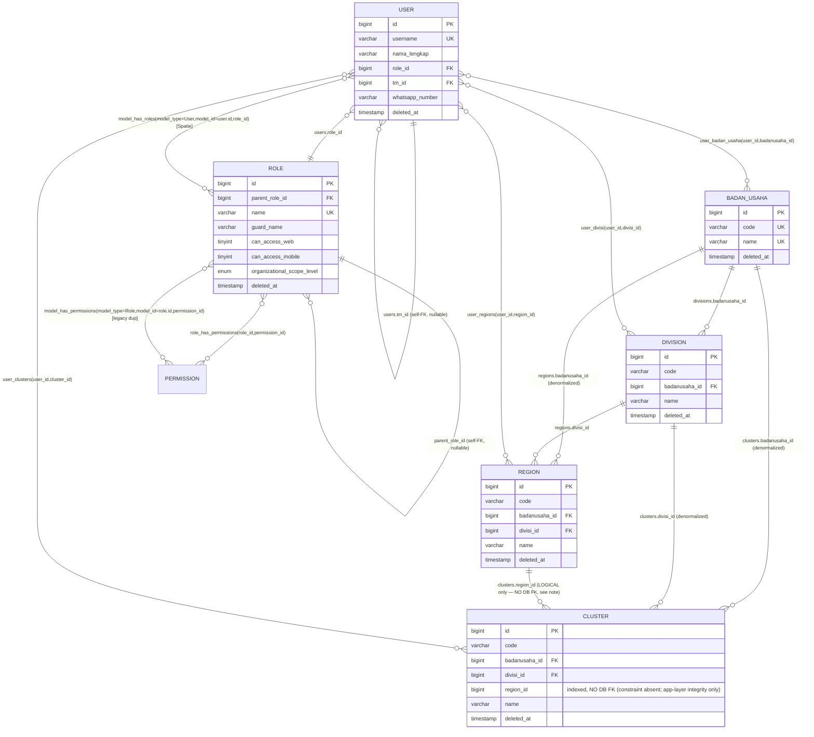
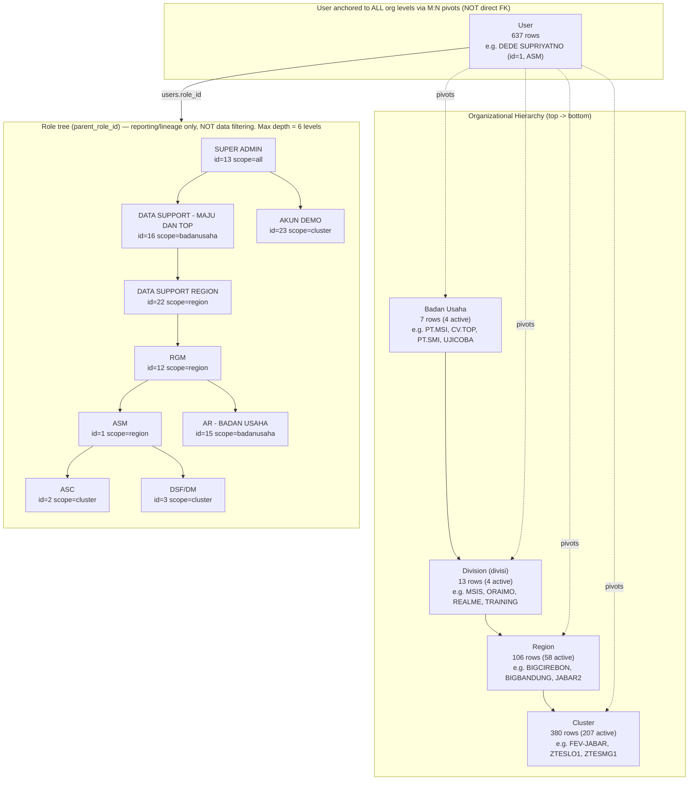
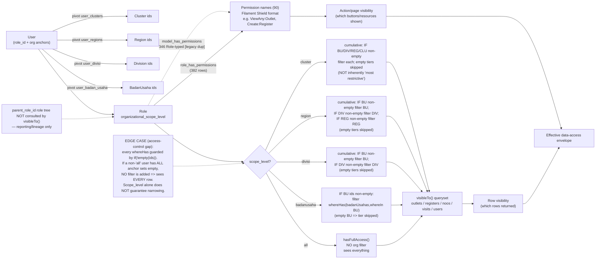

# Diagrama Hirarki Organisasi & Pemetaan Akses — web-sam

## Tujuan

Dokumen ini memvisualisasikan struktur organisasi (`Badan Usaha -> Division -> Region -> Cluster`), pohon peran (`roles.parent_role_id`), hierarki tim (`users.tm_id`), dan mekanisme pemetaan akses data (`User::scopeVisibleTo` + `getOrganizationalIds`) pada aplikasi web-sam. Tujuannya sebagai referensi visual bagi developer/admin untuk memahami siapa melihat data apa dan mengapa.

> **Penting:** Dokumen ini **hanya visualisasi**. Tidak ada perubahan pada skema database, migration, model, atau logic akses. Semua angka diambil dari live DB MySQL (`db=web-sam`) pada tanggal penyusunan.

---

## Ringkasan Data Nyata (Live DB)

### Roles
- Total **22 role** (20 aktif, **2 soft-deleted**: `DATA SUPPORT - TECNO` id=18, `ASM RIAU` id=20). Semua guard `web`.
- Distribusi **role aktif** per `organizational_scope_level` (terverifikasi via `DB::table('roles')->whereNull('deleted_at')->groupBy(...)`):
  - `all` = 5 (SUPER ADMIN, ADMIN, AR, AUDIT, CSOFASTEV)
  - `badanusaha` = 3 (BUSDEV, AR - BADAN USAHA, DATA SUPPORT - MAJU DAN TOP)
  - `divisi` = 4 (COO, CSO, RKAM, DATA SUPPORT - ZTE) — *DATA SUPPORT - TECNO dikecualikan karena soft-deleted*
  - `region` = 4 (RGM, ASM, DATA SUPPORT - ZTE JATENG JATIM, DATA SUPPORT REGION) — *ASM RIAU dikecualikan karena soft-deleted*
  - `cluster` = 4 (ASC, DSF/DM, KAM, AKUN DEMO)
  - **Total aktif = 20.**
- `can_access_web=1` untuk 13 role; `can_access_mobile=1` untuk **0 role** (fitur mobile belum dipakai).

### Users
- Total **637 user**, 0 tanpa `role_id`.
- Distribusi per role (terverifikasi): DSF/DM (cluster) = **456 (~72%)**, ASC (cluster) = 81, ASM (region) = 70, RGM (region) = 5, **DATA SUPPORT - MAJU DAN TOP = 4**, role lainnya 1-2 masing-masing (AR=2, CSO=2, CSOFASTEV=2, SUPER ADMIN=2, AUDIT=2, AR-BU=2, DATA SUPPORT-ZTE=2, DATA SUPPORT REGION=2, ADMIN=1, COO=1, RKAM=1, ASM RIAU=1, BUSDEV=1).
- **Long-tail berat:** satu role operasional DSF/DM memegang ~72% user. Setiap perubahan akses level cluster/region berdampak besar pada user DSF/DM.

### Badan Usaha
- 7 baris (4 aktif: PT.MSI id=1, CV.TOP id=2, UJICOBA id=6, PT.SMI id=7; 3 soft-deleted: id=3 `-`, id=4 PT.MKLI, id=5 CV.MAJU).

### Division (Divisi)
- 13 baris (4 aktif: MSIS id=1 under PT.MSI; ORAIMO id=2 + REALME id=4 under CV.TOP; TRAINING id=13 under UJICOBA; 9 soft-deleted batch 2026-03-13).

### Region
- 106 baris (58 aktif / 48 soft-deleted). Aktif per divisi induk: MSIS=37, REALME=10, ORAIMO=10, TRAINING=1. Contoh aktif: BIGCIREBON, BIGTEGAL, BIGSEMARANG, BIGSOLO, BIGJOGJA, BIGBANDUNG (divisi_id=4 REALME).

### Cluster
- 380 baris (207 aktif / 173 soft-deleted).
- Parent region berbeda: **98 distinct parent region untuk semua 380 cluster; 60 distinct parent region untuk 207 cluster aktif.**
- Contoh kode cluster **aktif**: `FEV-JABAR`, `ZTESLO1`, `ZTESMG1`, `ZTESMG2`, `ZTEPWT1`. (Catatan: `CSW1`, `CSW2`, `CNW1` yang sering disebut adalah **soft-deleted** 2026-03-13, jangan dipakai sebagai contoh aktif.)
- Region terbesar menampung 24 / 19 / 18 cluster; banyak region hanya 1-2 cluster.

### Permissions & Pivot
- `permissions` = 90 (guard `web`, format Filament Shield, mis. `ViewAny:Outlet`, `Create:Register`).
- Pivot: `role_has_permissions` = 382 (kanonik, dideklarasikan `Role::permissions()`); `model_has_permissions` = 346 (**semua** `model_type=App\Models\Role`, **0** User-typed — duplikasi legacy migration `2025_11_27_190222`); `model_has_roles` = 558 (semua User-typed, channel Spatie paralel).
- Pivot org-anchor user: `user_badan_usaha` = 642, `user_divisi` = 495, `user_regions` = 554, `user_clusters` = 542.

### Distribusi user_badan_usaha
- id=2 (CV.TOP) -> 345 user; id=1 (PT.MSI) -> 248; id=3 -> 33; id=4 -> 15; id=6 -> 1; id=5 & id=7 -> 0. 642 baris pivot untuk 628 user berbeda (sebagian multi-BU).

### Contoh User (dengan anchor)
- **id=1 DEDE SUPRIYATNO** — role ASM (region), tm_id=1 (self), anchor BU=3/DIV=5/REG=17/CLU=none. **Aktif.**
- **id=4 WANDA** — role SUPER ADMIN (all), tm_id=4 (self). **Aktif.**
- **id=90 TANTO** — role ASC (cluster), tm_id=11 (EKO PRAST), anchor BU=2/DIV=4/REG=26/CLU=76. **Soft-deleted** (2025-08-09) — ditampilkan sebagai contoh data, bukan user aktif.
- **id=140 YUDI GUNARA** — role DSF/DM (cluster), tm_id=6 (ANDIWIRA). **Soft-deleted** (2025-08-09).
- **id=213 ADI SUHADI** — top team lead (lihat bawah). **Soft-deleted** (2025-08-09).

---

## Diagram ERD



**Catatan FK `clusters.region_id` (koreksi mayor):** Di live DB **tidak ada foreign key constraint** pada `clusters.region_id`. `SHOW CREATE TABLE clusters` hanya menampilkan `KEY clusters_region_id_index` (index biasa), tanpa `clusters_region_id_foreign`. Migration `2025_09_13_101500_add_foreign_keys_and_indexes_to_org_hierarchy.php` memanggil `addForeign('clusters','region_id','regions')`, tetapi dibungkus `try/catch` yang menelan kegagalan akibat data yatim: **1 cluster** menunjuk region yang tidak ada, dan **117 cluster** menunjuk region soft-deleted, sehingga InnoDB menolak constraint. Sebaliknya `clusters.badanusaha_id` dan `clusters.divisi_id` **adalah FK sungguhan** (`ON DELETE RESTRICT ON UPDATE CASCADE`). Relasi logis `region_id -> regions.id` tetap dipakai via `Cluster::region()` (`belongsTo(Region::class)->withTrashed()`), tetapi integritas referensial hanya dijaga **di layer aplikasi** (model boot/saving hooks), bukan MySQL.

---

## Diagram Hirarki Organisasi



**Catatan:** Pohon peran (`parent_role_id`) memiliki **kedalaman maksimum 6 level** (5 sisi parent): `SUPER ADMIN(13) -> DATA SUPPORT - MAJU DAN TOP(16) -> DATA SUPPORT REGION(22) -> RGM(12) -> ASM(1) -> ASC(2)`. 14 dari 22 role adalah root (`parent_role_id` NULL). Pohon ini adalah metadata pelaporan/lineage dan **tidak** dipakai oleh `visibleTo()`.

---

## Diagram Alur Akses / Scope



---

## Penjelasan Cakupan Akses per Role / scope_level

Mekanisme: `User::scopeVisibleTo` + `getOrganizationalIds` (`app/Models/User.php`). Envelope akses = perkalian **tiga input independen**:

1. **`Role.organizational_scope_level`** — menyatakan KEDALAMAN filtering.
2. **Pivot org-anchor user** (`user_badan_usaha`, `user_divisi`, `user_regions`, `user_clusters`) — menyediakan ID unit konkret tiap kedalaman.
3. **Permission Spatie** (90 nama, via `role_has_permissions` 382 link) — mengatur aksi/resource Filament yang terlihat, ortogonal terhadap row visibility.

### Penyempitan scope per level (kondisional, BUKAN deterministik)

> **Koreksi mayor:** Setiap `whereHas` di `scopeVisibleTo` dijaga oleh `if (! empty($ids['...']))`. **Jika anchor pada suatu tier kosong, filter tier itu DILEWATI.** Karena itu pernyataan lama "cluster = paling restriktif" hanya benar **bila semua anchor terisi**. Jika user non-`all` punya **semua** anchor kosong, tidak ada `whereHas` ditambahkan dan query **tidak terfilter** — user melihat **semua baris** (kebalikan dari "restriktif"). Ini celah kontrol akses nyata, bukan kesalahan label. Default `scope_level` = `cluster`; tidak ada fallthrough deny-all.

- **`all`** (5 role aktif): `Role::hasFullAccess()` true. Tidak ada filter org. Hanya permission name yang membatasi aksi.
- **`badanusaha`** (3 role aktif): `IF` `user_badan_usaha` non-empty -> `whereHas('badanUsahas', whereIn id IN (...))`. Cincin non-global terluas.
- **`divisi`** (4 role aktif: COO, CSO, RKAM, DATA SUPPORT - ZTE): kumulatif — `IF` BU non-empty filter BU, `IF` DIV non-empty filter DIV. Seorang COO melihat semua di bawah BU+divisi yang diankrnya, lintas region/cluster.
- **`region`** (4 role aktif: RGM, ASM, DATA SUPPORT - ZTE JATENG JATIM, DATA SUPPORT REGION): kumulatif — BU + DIV + REG (masing-masing kondisional). ASM melihat outlet/user yang beririsan dengan BU+DIV+region ankrnya.
- **`cluster`** (4 role aktif: ASC, DSF/DM, KAM, AKUN DEMO): kumulatif — keempat tier (masing-masing kondisional). Paling restriktif **hanya bila semua anchor terisi**.

`scope_level` hanya menyatakan LEVEL; pivot user menentukan UNIT mana. Jadi dua user dengan role sama (mis. ASM) melihat data berbeda tergantung anchor `user_regions` mereka. Kolom denormalized `badanusaha_id`/`divisi_id`/`region_id` di downstream entity (cluster membawa ketiga ancestor FK, auto-sync via model boot hooks) membuat `whereHas` lintas-tier efisien.

Channel paralel `model_has_roles` (558 baris User-typed) dipakai oleh `can()`/`hasRole()` tetapi **tidak** oleh logic org-scope, yang membaca eksklusif dari `users.role_id`.

---

## Alur Tanggung Jawab (Siapa Atas Siapa)

Tanggung jawab berjalan pada **tiga sumbu independen**:

### Sumbu A — Nesting organisasi (tanggung jawab wilayah)
Pohon `Badan Usaha -> Division -> Region -> Cluster` adalah hirarki *containment*. Unit bawah dimiliki utuh oleh satu induk (`Region.divisi_id -> Division`, `Cluster.region_id -> Region`, dengan `badanusaha_id`/`divisi_id` denormalized auto-sync via boot hooks dan di-cascade saat update). Tanggung jawab mengikuti containment: pemilik BU bertanggung jawab atas semua divisi/region/cluster/outlet di bawahnya; lead divisi atas region/cluster di bawahnya; hingga cluster (unit terbawah, di atas outlets/users/registers).

> **Catatan integritas region_id:** Seperti dijelaskan di ERD, `clusters.region_id` **tidak memiliki FK DB-level**. Cascade ancestor ID di-cascade hanya di layer model (application-enforced), bukan MySQL. Bila region induk berpindah, model memperbarui cluster anak, tetapi tidak ada jaminan referensial dari DB — perlu dijaga via test/data hygiene.

### Sumbu B — Pohon pelaporan peran (`parent_role_id`)
Role membentuk pohon self-referential (`Role::parent`/`Role::children`, FK `roles.parent_role_id -> roles.id`, nullable, `nullOnDelete`). Ini melaturlineage pelaporan/inheritance antar peran, **bukan** akses data. Pohon live (kedalaman maks **6 level**):
```
SUPER ADMIN(13) -> DATA SUPPORT - MAJU DAN TOP(16) -> DATA SUPPORT REGION(22) -> RGM(12) -> { ASM(1), AR - BADAN USAHA(15) }
ASM(1) -> { ASC(2), DSF/DM(3) }
SUPER ADMIN(13) -> AKUN DEMO(23)
```
14 role root. Peran induk secara konseptual membawahi peran anak, tetapi **tidak** mengubah data scope anak: user DSF/DM di bawah ASM tidak mewarisi data region-level ASM — scope mereka tetap ditentukan oleh `role.scope_level` (cluster) dan pivot anchor sendiri.

### Sumbu C — Hirarki tim (`users.tm_id`)
FK self-referential terpisah (`users.tm_id -> users.id`, nullable, `restrictOnDelete`) membentuk rantai Territory Manager -> anggota tim. **Top team lead berdasarkan jumlah anggota (mengecualikan baris self-referencing tm_id=lead.id sendiri, terverifikasi):**

| Lead | id | tm_id lead | Anggota (excl self) |
|---|---|---|---|
| ADI SUHADI | 213 | 213 (self) | 91 |
| EKO PRAST | 11 | 203 | 68 |
| ANDIWIRA | 6 | 4 | 57 |
| ROBBY AGUSTINA | 2 | 2 (self) | 47 |
| WANDA | 4 | 4 (self) | 28 |

Beberapa lead menunjuk `tm_id` ke id sendiri. `tm_id` dipakai untuk supervision/approval (mis. `Registers.tm_id`) dan grouping, **bukan** untuk scoping data — data anggota tim tetap ditentukan oleh role + anchor org mereka sendiri.

### Ringkasan
- Tanggung jawab wilayah mengalir **KE BAWAH** pohon org (containment).
- Pelaporan peran mengalir **KE BAWAH** pohon `parent_role_id` (lineage).
- Supervisi tim mengalir **KE BAWAH** rantai `tm_id`.
- **Hanya sumbu A (containment org-tree) yang benar-benar menggerakkan runtime data-access scope**; dua sumbu lain adalah metadata manajemen/pelaporan.

---

## Catatan Penting (Key Findings & Ambiguitas)

1. **Anchoring user PIVOT-ONLY.** Kolom FK langsung lama (`badanusaha_id`, `divisi_id`, `region_id`, `cluster_id`, `cluster_id2`) dihapus dari `users` oleh migration `2025_11_19_160356` dan datanya dimigrasi ke pivot M:N. Model `BadanUsaha` masih mendefinisikan `hasMany(User,'badanusaha_id')` yang kini **rusak** (kolom hilang) — jangan gambar `users.badanusaha_id` sebagai FK live; gambar pivot.
2. **Dua channel role-assignment paralel tidak tersinkron:** (1) `users.role_id` — FK NOT NULL kanonik, dipakai semua logic scope/filter; (2) `model_has_roles` Spatie (558 User-typed) untuk `can()`/`hasRole()`. 637 user vs 558 baris -> ~79 user hanya andalkan `role_id`. `visibleTo()`/`getOrganizationalIds()` membaca eksklusif `role_id`.
3. **Dua pivot role-permission paralel:** `role_has_permissions` (382, kanonik, `Role::permissions()`) dan `model_has_permissions` (346, semua `model_type=Role` — duplikasi legacy migration `2025_11_27_190222`). **0 baris User-typed** -> user tidak punya permission langsung; semua cek permission melewati role.
4. **`User::permissions()` override non-standar:** `belongsToMany` ke `role_has_permissions` memakai `role_id` user sendiri sebagai key, bukan `model_has_permissions` Spatie. `$user->permissions` mengembalikan set role langsung; `canImpersonate()` bergantung padnya.
5. **`tm_id`** self-referential terpisah — hirarki tim, independen dari pohon org dan pohon role. Beberapa lead self-referencing. Dipakai supervision/approval, **bukan** scope data.
6. **`parent_role_id`** pohon pelaporan (lineage), **bukan** filter data. 14/22 role root. Kedalaman maks **6 level**.
7. **Penamaan FK tidak konsisten & load-bearing:** FK induk `Division` bernama `badanusaha_id` (snake_case penuh), tetapi semua child (Region, Cluster, User, Outlet, Register) reference divisi via `divisi_id` (singkatan Indonesia), **bukan** `division_id`. Pivot `user_divisi` juga `divisi_id`. Salah menamai kolom akan merusak ERD.
8. **Region & Cluster bawa DENORMALIZED ancestor FK** (`badanusaha_id`+`divisi_id` di keduanya; cluster juga `region_id`), auto-sync via boot saving hooks, di-cascade saat update. **Khusus `clusters.region_id`: FK DB-level ABSENT** (lihat ERD) — integritas hanya di layer aplikasi. `clusters.badanusaha_id` & `clusters.divisi_id` adalah FK sungguhan.
9. **Uniqueness code/name parent-SCOPED, bukan global:** division unik per `badanusaha_id`, region unik per `divisi_id`, cluster unik per `region_id` (composite unique `2026_06_17`; `clusters_name_unique` global lama di-drop). Jadi kode `CSW1` hanya unik dalam regionnya.
10. **`can_access_mobile` disiapkan (default 0) tapi UNUSED** — 0/22 role. Semua role saat ini web-or-nothing (13 web-enabled, 9 web-disabled). Guard `mobile`/API tidak ada di data; semua role/permission guard `web`.
11. **`organizational_scope_level` menggantikan** kolom JSON lama `filter_type`/`filter_data` di roles (ditambah `2025_11_19_144829`, lama di-drop `2025_11_19_225015`). Enum: `all/badanusaha/divisi/region/cluster`, default `cluster`. `Role::hasFullAccess()` true saat `scope_level==='all'`.
12. **Scope filtering KUMULATIF top-down BERSYARAT, bukan eksklusif/deterministik:** tier difilter hanya bila anchor non-empty. Akibatnya **empty anchors => akses tak terbatas untuk role non-`all`** (celah kontrol akses). Long-tail DSF/DM (cluster, ~72% user) paling rentan punya anchor tidak lengkap.
13. **Long-tail distribusi user:** DSF/DM (cluster) ~72% (456/637); ASC 81; ASM 70; sisanya 1-4 per role (DATA SUPPORT - MAJU DAN TOP=4). Perubahan akses cluster/region berdampak disproportional ke DSF/DM.
14. **Contoh soft-deleted vs aktif:** id=90 TANTO, id=140 YUDI GUNARA, id=213 ADI SUHADI (semua soft-deleted 2025-08-09) dipakai sebagai contoh data, bukan user aktif. Kode cluster `CSW1/CSW2/CNW1` soft-deleted (2026-03-13); contoh cluster aktif: `FEV-JABAR`, `ZTESLO1`, `ZTESMG1`.

---

## Penegasan

Dokumen ini **murni visualisasi** hasil pembacaan skema, model, migration, dan data live DB `web-sam`. **Tidak ada perubahan** pada database, migration, model, policy, atau logic akses yang dilakukan atau disarankan untuk dijalankan otomatis. Setiap perbaikan data (mis. menghapus orphan `clusters.region_id`, mengisi anchor kosong, atau memasang FK yang gagal) harus dilakukan secara eksplisit oleh tim engineering setelah evaluasi terpisah.